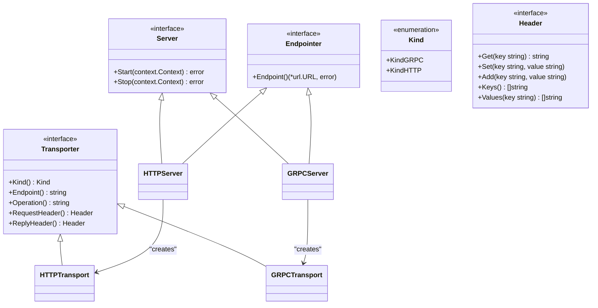
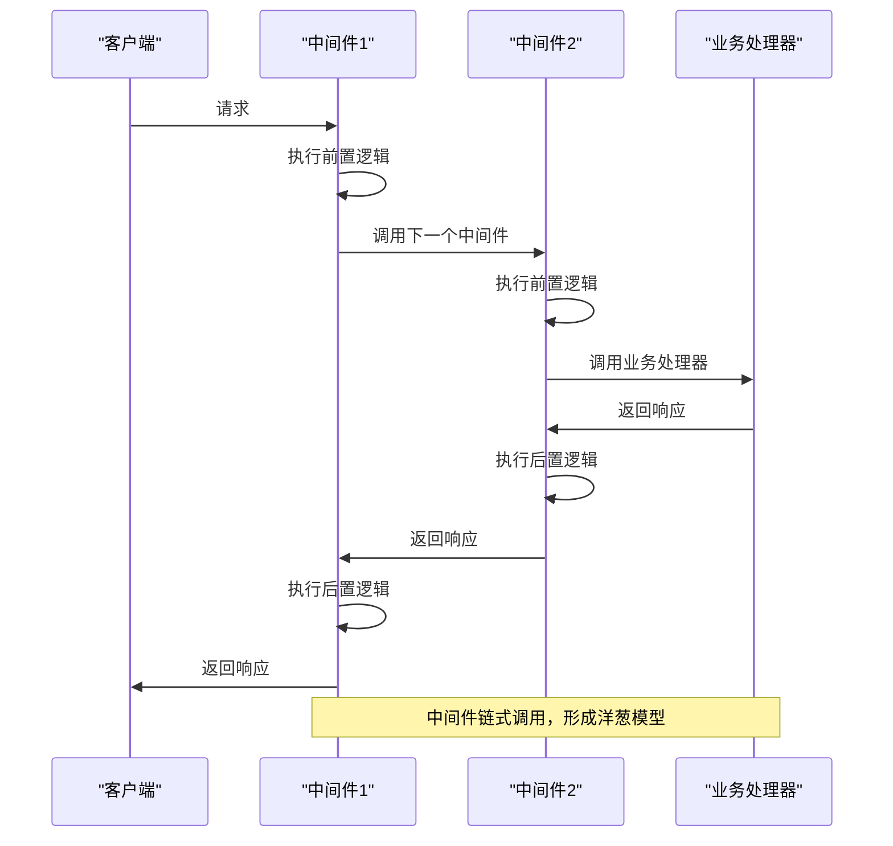
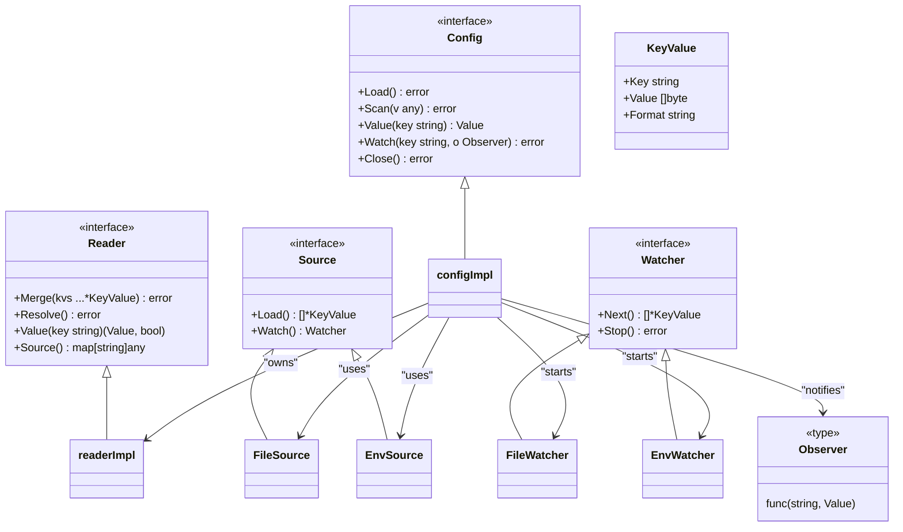
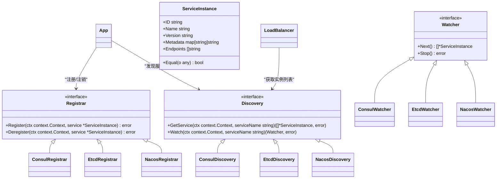

# 核心概念

<cite>
**本文档中引用的文件**  
- [app.go](file://app.go)
- [options.go](file://options.go)
- [transport/transport.go](file://transport/transport.go)
- [transport/http/server.go](file://transport/http/server.go)
- [transport/grpc/server.go](file://transport/grpc/server.go)
- [config/config.go](file://config/config.go)
- [config/options.go](file://config/options.go)
- [config/source.go](file://config/source.go)
- [config/file/file.go](file://config/file/file.go)
- [config/env/env.go](file://config/env/env.go)
- [middleware/middleware.go](file://middleware/middleware.go)
- [middleware/logging/logging.go](file://middleware/logging/logging.go)
- [registry/registry.go](file://registry/registry.go)
</cite>

## 目录
1. [应用生命周期](#应用生命周期)
2. [传输层抽象](#传输层抽象)
3. [中间件模式](#中间件模式)
4. [配置管理](#配置管理)
5. [服务注册与发现](#服务注册与发现)

## 应用生命周期

`App` 结构体是 Kratos 框架中应用生命周期的核心管理器，负责服务的启动、运行和优雅关闭。它通过 `Run()` 方法执行所有在 `Lifecycle` 中注册的 `OnStart` 钩子，启动所有注册的服务器，并在接收到系统信号（如 SIGTERM、SIGQUIT、SIGINT）时触发 `Stop()` 方法进行优雅关闭。

`App` 的构造通过 `New()` 函数完成，接受一系列 `Option` 参数来配置应用的 ID、名称、版本、元数据、服务器实例、注册中心等。`Run()` 方法内部使用 `errgroup` 来并行启动所有服务器，并通过 `sync.WaitGroup` 确保所有服务器的启动过程已经开始，然后才进行服务注册。在接收到停止信号后，`Stop()` 方法会依次执行 `beforeStop` 钩子、从注册中心注销服务，并调用 `context.CancelFunc` 来通知所有监听上下文的协程进行清理。

**Section sources**
- [app.go](file://app.go#L29-L213)
- [options.go](file://options.go#L14-L130)

## 传输层抽象

Kratos 框架通过 `transport` 包实现了对不同通信协议的抽象，统一了 HTTP 和 gRPC 的处理方式。核心是 `Server` 接口，它定义了所有传输服务器必须实现的 `Start` 和 `Stop` 方法。`Endpointer` 接口则用于获取服务器的端点地址，这对于服务注册至关重要。

`Transporter` 接口是传输层上下文的核心，它携带了传输类型（`KindHTTP` 或 `KindGRPC`）、操作方法名（如 `/helloworld.Greeter/SayHello`）、请求头和回复头等信息。这些信息通过 `NewServerContext` 和 `FromServerContext` 等函数在请求处理链中传递，使得中间件可以基于这些信息进行统一的处理。

HTTP 和 gRPC 服务器的具体实现分别位于 `transport/http` 和 `transport/grpc` 包中。它们都实现了 `Server` 和 `Endpointer` 接口，并在各自的 `Start` 方法中监听网络端口，在 `Stop` 方法中优雅地关闭服务。

**Diagram sources**
- [transport/transport.go](file://transport/transport.go#L15-L96)
- [transport/http/server.go](file://transport/http/server.go#L156-L375)
- [transport/grpc/server.go](file://transport/grpc/server.go#L131-L278)

## 中间件模式

Kratos 框架的中间件模式基于函数式编程思想，通过函数链式调用实现。核心是 `Middleware` 类型，它是一个接收 `Handler` 并返回新 `Handler` 的函数。`Handler` 代表了实际的业务处理函数。

`Chain` 函数是中间件链的核心，它接收多个中间件函数，并将它们组合成一个单一的中间件。组合的顺序是反向的，即最后一个中间件最先被调用，这保证了调用栈的正确性。当一个请求到来时，它会依次经过中间件链的处理，每个中间件都可以在调用下一个处理函数之前或之后执行自己的逻辑。

例如，日志中间件 `logging.Server` 会在业务处理函数执行前后记录日志和执行时间。它通过 `transport.FromServerContext` 从上下文中获取操作名和传输类型，并在 `handler(ctx, req)` 调用前后计算执行时间，最后将这些信息通过日志组件输出。

**Diagram sources**
- [middleware/middleware.go](file://middleware/middleware.go#L7-L21)
- [middleware/logging/logging.go](file://middleware/logging/logging.go#L23-L59)

## 配置管理

Kratos 的配置管理组件 `config` 支持从多种来源（文件、环境变量、远程配置中心）加载配置，并能将它们合并。其核心是 `Config` 接口，定义了 `Load`、`Scan`、`Value`、`Watch` 和 `Close` 等方法。

`Source` 接口代表一个配置源，`Load()` 方法用于一次性加载所有配置，`Watch()` 方法返回一个 `Watcher` 用于监听配置的动态变化。框架内置了 `file` 和 `env` 源，分别用于从文件和环境变量中读取配置。`Reader` 负责将不同格式（JSON、YAML等）的原始配置数据解析并合并到一个统一的内存视图中。

`Config` 的实现会遍历所有 `Source`，调用它们的 `Load()` 方法获取初始配置，并启动 `Watcher` 监听后续变更。当配置发生变化时，`watch()` 协程会将其合并到 `Reader` 中，并通知所有注册了 `Observer` 的监听者。`Value()` 方法提供了对配置项的访问，支持路径查询（如 `app.name`），并带有缓存机制以提高性能。

**Diagram sources**
- [config/config.go](file://config/config.go#L27-L159)
- [config/source.go](file://config/source.go#L10-L21)
- [config/options.go](file://config/options.go#L22-L69)
- [config/file/file.go](file://config/file/file.go#L12-L81)
- [config/env/env.go](file://config/env/env.go#L10-L63)

## 服务注册与发现

Kratos 框架通过 `registry` 包实现了服务注册与发现。核心是 `Registrar` 和 `Discovery` 两个接口。`Registrar` 负责将服务实例注册到注册中心（如 Consul、Etcd、Nacos）并在服务关闭时注销。`Discovery` 负责根据服务名查询可用的服务实例列表，并提供 `Watch` 功能来监听服务实例的变化。

`ServiceInstance` 结构体定义了服务实例的元数据，包括唯一 ID、服务名、版本、元数据（KV 对）和端点列表（如 `http://127.0.0.1:8000`）。`App` 在启动时会调用 `Registrar.Register()` 方法进行注册，在关闭时调用 `Deregister()` 方法进行注销。

`Discovery` 的 `GetService()` 方法返回当前已知的服务实例列表，而 `Watch()` 方法返回一个 `Watcher`，客户端可以持续调用其 `Next()` 方法来获取最新的服务实例变更。这使得客户端能够实现服务发现和负载均衡。

**Diagram sources**
- [registry/registry.go](file://registry/registry.go#L9-L96)
- [app.go](file://app.go#L82-L169)