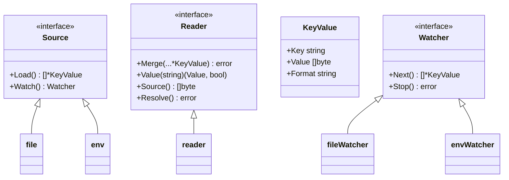
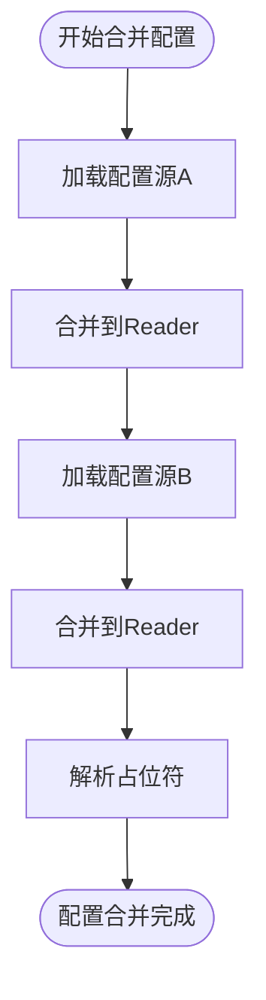
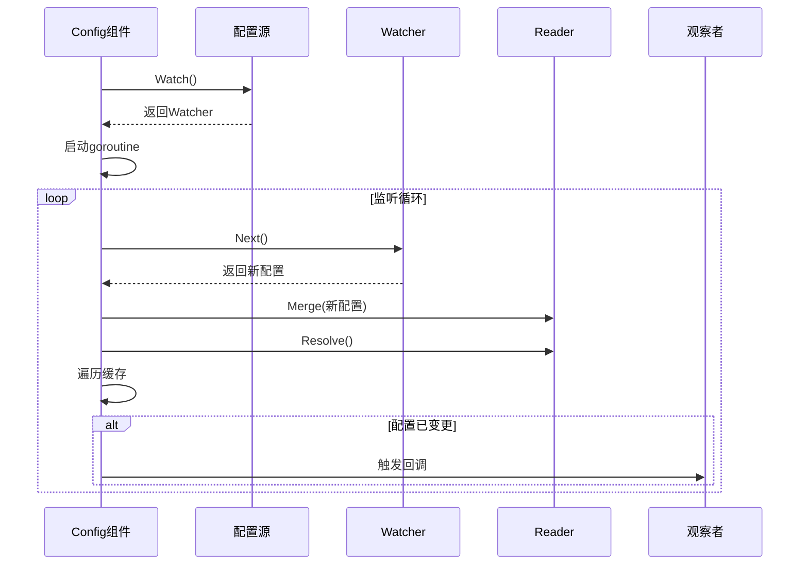
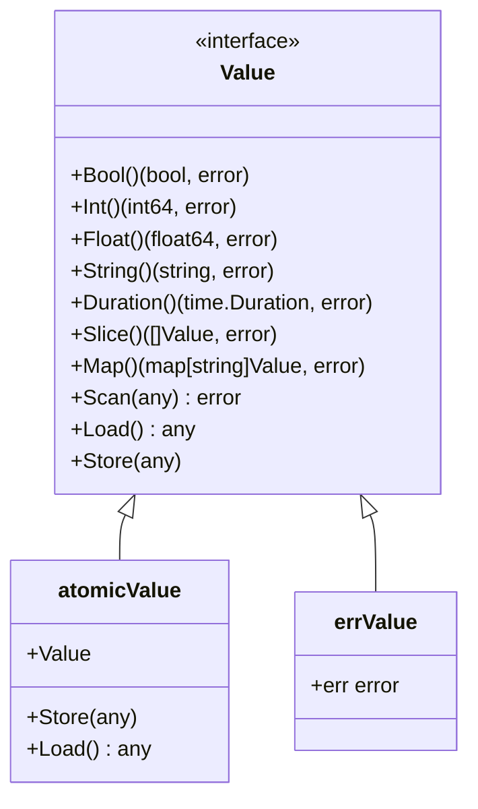
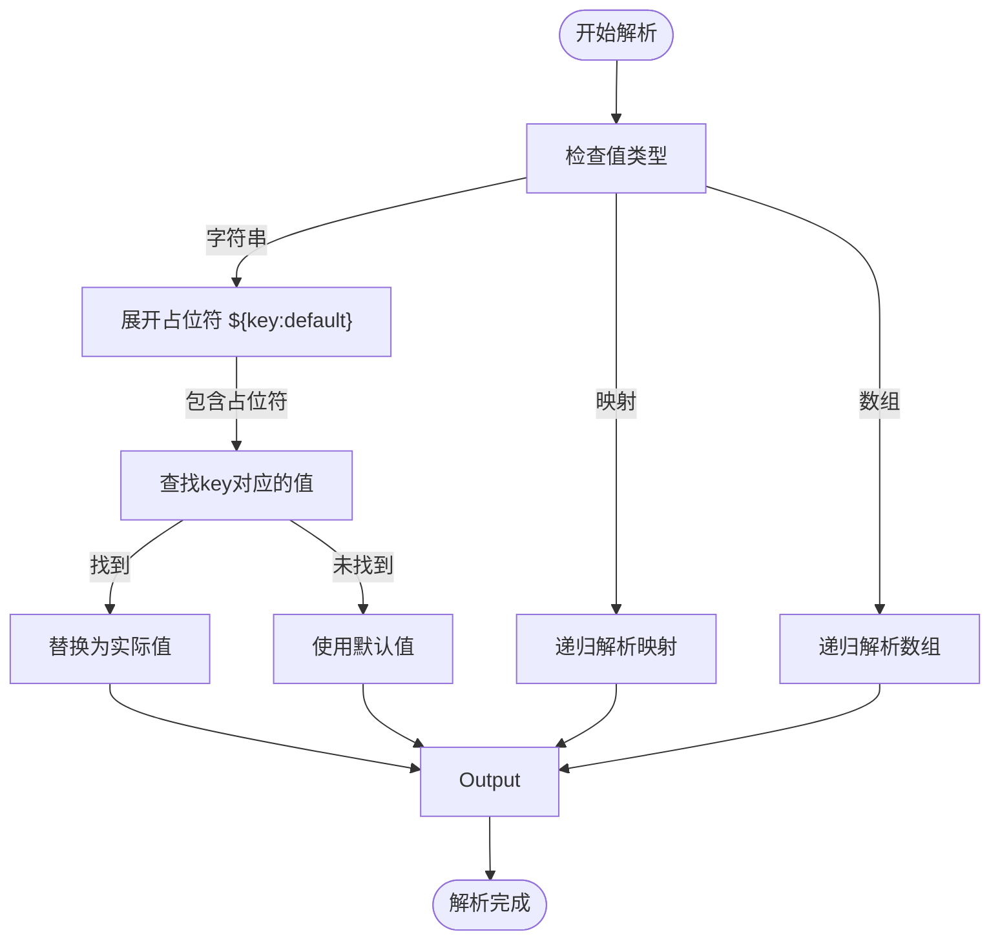

# 配置管理

<cite>
**本文档引用的文件**
- [config.go](file://config/config.go)
- [source.go](file://config/source.go)
- [reader.go](file://config/reader.go)
- [options.go](file://config/options.go)
- [value.go](file://config/value.go)
- [file.go](file://config/file/file.go)
- [env.go](file://config/env/env.go)
- [watcher.go](file://config/file/watcher.go)
- [env_watcher.go](file://config/env/watcher.go)
- [format.go](file://config/file/format.go)
- [encoding.go](file://encoding/encoding.go)
- [json.go](file://encoding/json/json.go)
- [yaml.go](file://encoding/yaml/yaml.go)
- [config_test.go](file://config/config_test.go)
- [options_test.go](file://config/options_test.go)
- [file_test.go](file://config/file/file_test.go)
- [env_test.go](file://config/env/env_test.go)
</cite>

## 目录
1. [简介](#简介)
2. [配置源与配置读取器](#配置源与配置读取器)
3. [配置合并与优先级](#配置合并与优先级)
4. [配置监听与热更新](#配置监听与热更新)
5. [配置值访问与类型转换](#配置值访问与类型转换)
6. [配置解析与占位符替换](#配置解析与占位符替换)
7. [多源配置合并示例](#多源配置合并示例)
8. [安全实践](#安全实践)

## 简介
Kratos框架的配置管理组件提供了一套灵活、可扩展的配置管理机制，支持从多种来源加载配置，并能动态监听配置变更。该组件通过接口抽象实现了配置源、配置解析和配置监听的解耦，使得开发者可以轻松地集成不同类型的配置存储（如文件、环境变量、远程配置中心）并实现配置的热更新。本文档将深入分析该配置管理组件的设计与实现，重点介绍多源配置合并、动态更新、配置解析等核心功能。

## 配置源与配置读取器

配置管理组件的核心是`Source`和`Reader`接口。`Source`接口抽象了配置的来源，而`Reader`接口则负责配置的解析和合并。通过这种设计，配置管理组件可以支持多种配置格式和来源。

**配置源接口 (Source)**
`Source`接口定义了两个核心方法：`Load()`用于一次性加载配置，`Watch()`用于创建一个`Watcher`来监听配置变更。不同的配置源实现（如文件、环境变量）都遵循这一接口。



**Diagram sources**
- [source.go](file://config/source.go#L10-L20)
- [reader.go](file://config/reader.go#L17-L22)
- [file.go](file://config/file/file.go#L12-L14)
- [env.go](file://config/env/env.go#L10-L11)
- [watcher.go](file://config/file/watcher.go#L13-L14)
- [env_watcher.go](file://config/env/watcher.go#L9-L10)

**Section sources**
- [source.go](file://config/source.go#L10-L20)
- [reader.go](file://config/reader.go#L17-L22)

## 配置合并与优先级

当多个配置源存在时，Kratos配置管理组件通过`Reader`的`Merge`方法将它们合并。合并策略由`Merge`函数决定，默认使用`mergo.Map`函数进行合并，支持覆盖模式。配置的优先级由加载顺序决定，后加载的配置源具有更高的优先级。



**Diagram sources**
- [config.go](file://config/config.go#L96-L120)
- [reader.go](file://config/reader.go#L39-L58)

**Section sources**
- [config.go](file://config/config.go#L96-L120)
- [reader.go](file://config/reader.go#L39-L58)
- [options.go](file://config/options.go#L49-L51)

## 配置监听与热更新

配置监听是通过`Watcher`接口实现的。每个配置源在调用`Watch()`方法时返回一个`Watcher`实例。`Config`组件会为每个`Watcher`启动一个独立的goroutine，通过`Next()`方法阻塞等待配置变更事件。当检测到变更时，新的配置会被加载、合并并触发观察者回调。



**Diagram sources**
- [config.go](file://config/config.go#L62-L93)
- [watcher.go](file://config/file/watcher.go#L35-L60)
- [env_watcher.go](file://config/env/watcher.go#L22-L24)

**Section sources**
- [config.go](file://config/config.go#L62-L93)
- [watcher.go](file://config/file/watcher.go#L35-L60)
- [env_watcher.go](file://config/env/watcher.go#L22-L24)

## 配置值访问与类型转换

`Value`接口提供了统一的配置值访问方式，支持多种数据类型（bool、int、float、string、duration、slice、map）的转换。`Value`的实现（`atomicValue`）使用`sync/atomic.Value`来保证并发安全，允许在配置更新时安全地读取配置值。



**Diagram sources**
- [value.go](file://config/value.go#L21-L32)
- [value.go](file://config/value.go#L35-L37)
- [value.go](file://config/value.go#L180-L182)

**Section sources**
- [value.go](file://config/value.go#L21-L32)

## 配置解析与占位符替换

`Reader`在合并配置后会调用`Resolve()`方法进行配置解析。默认的`defaultResolver`支持`${key:default}`格式的占位符替换，可以从其他配置项或环境变量中获取值。如果启用了`WithResolveActualTypes`选项，解析器还会尝试将字符串值转换为实际的数据类型（bool、int、float）。



**Diagram sources**
- [options.go](file://config/options.go#L101-L136)
- [options.go](file://config/options.go#L152-L178)

**Section sources**
- [options.go](file://config/options.go#L101-L136)

## 多源配置合并示例

以下示例展示了如何将文件配置源和环境变量配置源进行合并，并监听配置变更：

```go
// 创建配置实例，合并文件和环境变量配置源
c := config.New(
    config.WithSource(
        file.NewSource("config.yaml"), // 文件配置源
        env.NewSource("APP_"),         // 环境变量配置源，前缀为APP_
    ),
    config.WithResolver(config.DefaultResolver), // 使用默认解析器
)

// 加载配置
if err := c.Load(); err != nil {
    log.Fatal(err)
}

// 监听配置变更
if err := c.Watch("server.port", func(key string, value config.Value) {
    port, _ := value.Int()
    log.Infof("配置更新: %s = %d", key, port)
    // 重新加载服务器配置
}); err != nil {
    log.Error(err)
}
```

**Section sources**
- [config_test.go](file://config/config_test.go#L111-L125)
- [file_test.go](file://config/file/file_test.go#L194-L202)
- [env_test.go](file://config/env/env_test.go#L59-L62)

## 安全实践

在配置管理中，敏感信息（如数据库密码、API密钥）的安全保护至关重要。建议采用以下安全实践：
1. **环境变量优先**：将敏感信息存储在环境变量中，而不是配置文件中。
2. **配置加密**：对包含敏感信息的配置文件进行加密，在应用启动时解密。
3. **最小权限原则**：确保应用运行的用户只具有读取必要配置文件的权限。
4. **避免日志泄露**：在日志中输出配置信息时，注意过滤敏感字段。
5. **使用远程配置中心**：利用Apollo、Nacos等远程配置中心的安全特性，如权限控制、审计日志等。

**Section sources**
- [env.go](file://config/env/env.go#L14-L15)
- [contrib/config/apollo/apollo.go](file://contrib/config/apollo/apollo.go)
- [contrib/config/nacos/config.go](file://contrib/config/nacos/config.go)