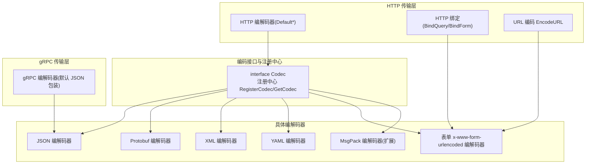
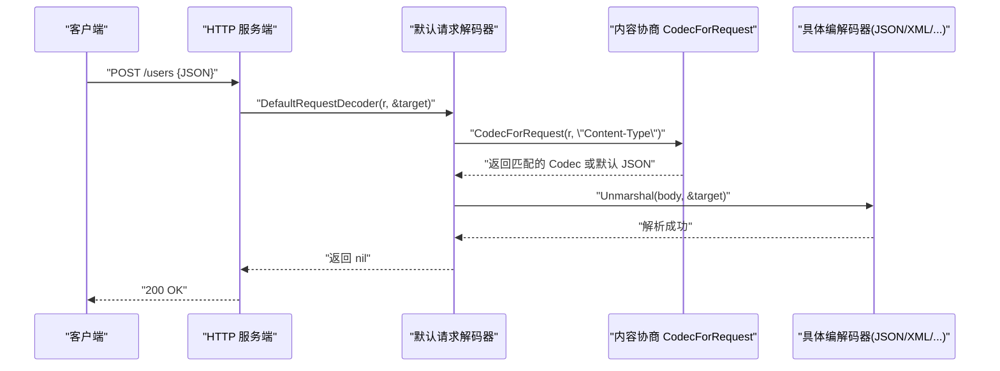
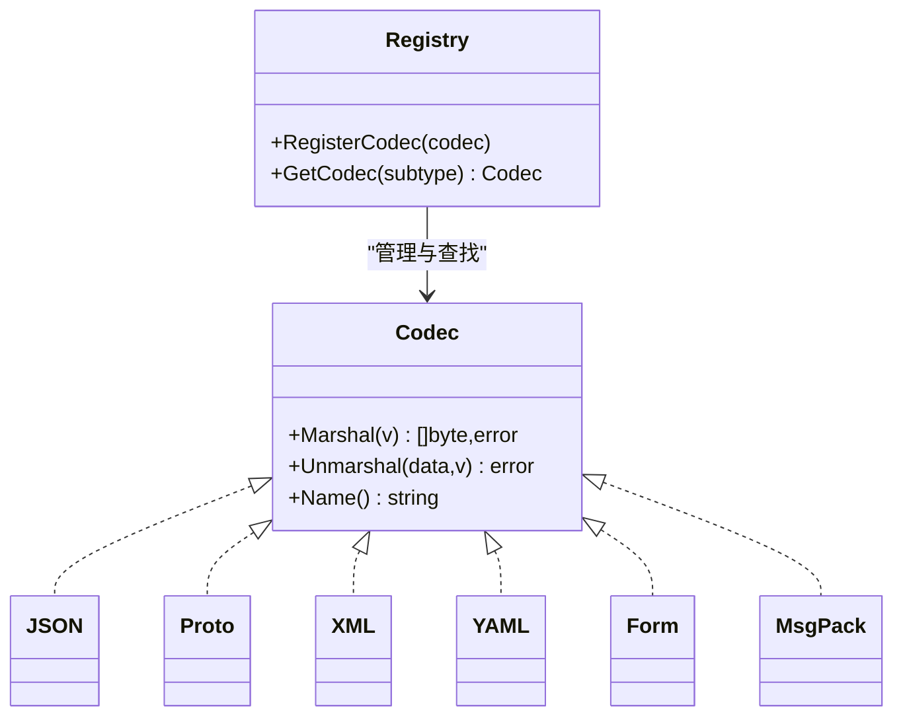
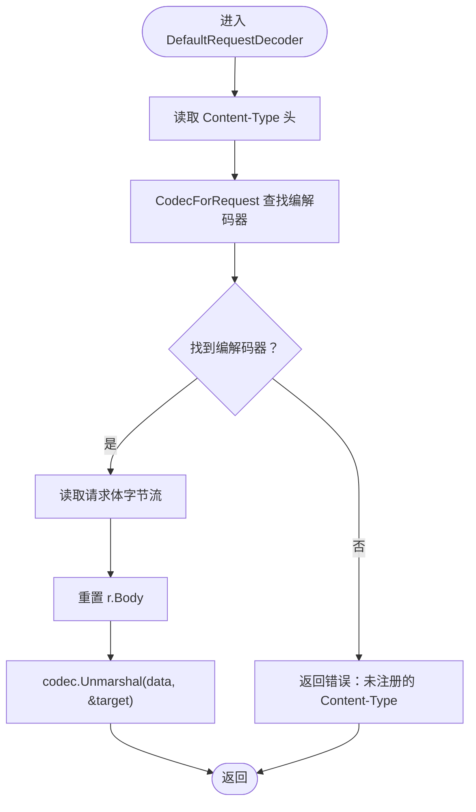
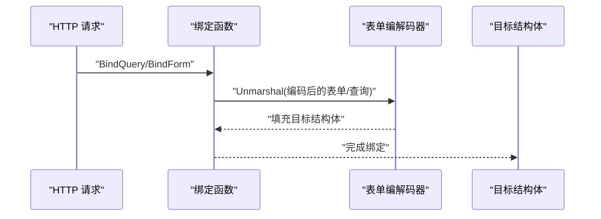
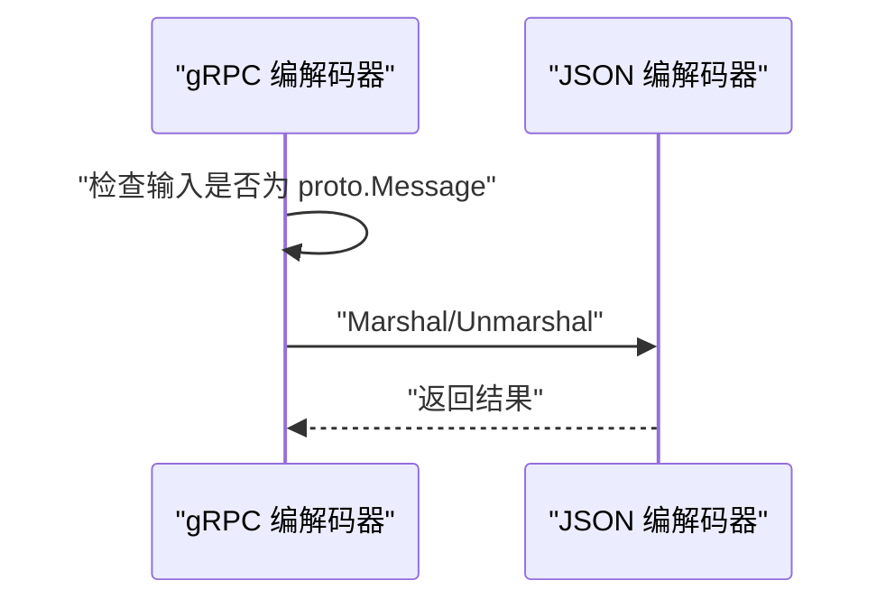
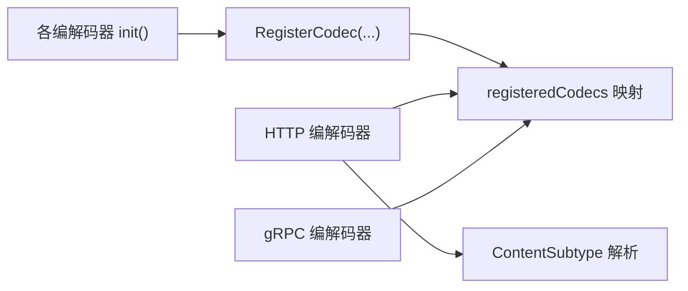

# 编码系统

<cite>
**本文引用的文件**
- [encoding/encoding.go](file://encoding/encoding.go)
- [encoding/json/json.go](file://encoding/json/json.go)
- [encoding/proto/proto.go](file://encoding/proto/proto.go)
- [encoding/xml/xml.go](file://encoding/xml/xml.go)
- [encoding/yaml/yaml.go](file://encoding/yaml/yaml.go)
- [encoding/form/form.go](file://encoding/form/form.go)
- [contrib/encoding/msgpack/msgpack.go](file://contrib/encoding/msgpack/msgpack.go)
- [transport/http/codec.go](file://transport/http/codec.go)
- [transport/http/binding/bind.go](file://transport/http/binding/bind.go)
- [transport/http/binding/encode.go](file://transport/http/binding/encode.go)
- [transport/grpc/codec.go](file://transport/grpc/codec.go)
- [internal/httputil/http.go](file://internal/httputil/http.go)
- [transport/http/codec_test.go](file://transport/http/codec_test.go)
- [encoding/encoding_test.go](file://encoding/encoding_test.go)
- [contrib/encoding/msgpack/msgpack_test.go](file://contrib/encoding/msgpack/msgpack_test.go)
</cite>

## 目录
1. [简介](#简介)
2. [项目结构](#项目结构)
3. [核心组件](#核心组件)
4. [架构总览](#架构总览)
5. [详细组件分析](#详细组件分析)
6. [依赖关系分析](#依赖关系分析)
7. [性能考量](#性能考量)
8. [故障排查指南](#故障排查指南)
9. [结论](#结论)
10. [附录：自定义编解码器开发指南](#附录自定义编解码器开发指南)

## 简介
本文件系统性阐述 Kratos 框架的编码系统，重点覆盖以下方面：
- 内容协商（Content Negotiation）与自动编解码机制
- encoding 包如何基于 HTTP 请求的 Accept 和 Content-Type 头自动选择合适的编解码器（如 JSON、Protobuf、XML、YAML、表单）
- 编解码器注册机制与查找逻辑
- HTTP 传输中 binding 包如何将请求体反序列化为 Go 结构体，并将响应序列化回客户端
- gRPC 传输强制使用 Protobuf 的特性
- 自定义编解码器开发指南（支持 XML、MsgPack 等）

## 项目结构
编码系统主要由三部分组成：
- 编解码接口与注册中心：位于 encoding 包
- 具体编解码器实现：位于 encoding 子包及 contrib 扩展
- 传输层对接：HTTP 与 gRPC 分别在 transport/http 与 transport/grpc 中实现内容协商与编解码调用

图表来源
- [encoding/encoding.go](file://encoding/encoding.go#L1-L43)
- [encoding/json/json.go](file://encoding/json/json.go#L1-L69)
- [encoding/proto/proto.go](file://encoding/proto/proto.go#L1-L52)
- [encoding/xml/xml.go](file://encoding/xml/xml.go#L1-L30)
- [encoding/yaml/yaml.go](file://encoding/yaml/yaml.go#L1-L30)
- [encoding/form/form.go](file://encoding/form/form.go#L1-L88)
- [contrib/encoding/msgpack/msgpack.go](file://contrib/encoding/msgpack/msgpack.go#L1-L30)
- [transport/http/codec.go](file://transport/http/codec.go#L1-L130)
- [transport/http/binding/bind.go](file://transport/http/binding/bind.go#L1-L30)
- [transport/http/binding/encode.go](file://transport/http/binding/encode.go#L1-L56)
- [transport/grpc/codec.go](file://transport/grpc/codec.go#L1-L39)

章节来源
- [encoding/encoding.go](file://encoding/encoding.go#L1-L43)
- [transport/http/codec.go](file://transport/http/codec.go#L1-L130)

## 核心组件
- Codec 接口：定义编解码器必须实现的方法，包括 Marshal、Unmarshal、Name。Name 返回值用于作为 Content-Type 的子类型标识。
- 注册中心：通过 RegisterCodec 注册编解码器；通过 GetCodec 按子类型名查找已注册编解码器。
- 具体编解码器：
  - JSON：支持标准 JSON 与 Protobuf 消息的互操作
  - Protobuf：默认 gRPC 使用的二进制编解码器
  - XML/YAML：文本格式编解码器
  - 表单：x-www-form-urlencoded 编解码器，支持 Protobuf 字段掩码编码
  - MsgPack：第三方库实现的二进制编解码器（扩展）

章节来源
- [encoding/encoding.go](file://encoding/encoding.go#L1-L43)
- [encoding/json/json.go](file://encoding/json/json.go#L1-L69)
- [encoding/proto/proto.go](file://encoding/proto/proto.go#L1-L52)
- [encoding/xml/xml.go](file://encoding/xml/xml.go#L1-L30)
- [encoding/yaml/yaml.go](file://encoding/yaml/yaml.go#L1-L30)
- [encoding/form/form.go](file://encoding/form/form.go#L1-L88)
- [contrib/encoding/msgpack/msgpack.go](file://contrib/encoding/msgpack/msgpack.go#L1-L30)

## 架构总览
HTTP 与 gRPC 在各自的传输层实现内容协商与编解码调用。HTTP 侧通过请求头中的 Content-Type/Accept 选择编解码器；gRPC 侧默认使用 Protobuf，但通过包装 JSON 实现兼容。

图表来源
- [transport/http/codec.go](file://transport/http/codec.go#L60-L104)
- [transport/http/codec.go](file://transport/http/codec.go#L120-L130)
- [internal/httputil/http.go](file://internal/httputil/http.go#L1-L35)
- [encoding/encoding.go](file://encoding/encoding.go#L1-L43)

章节来源
- [transport/http/codec.go](file://transport/http/codec.go#L1-L130)
- [internal/httputil/http.go](file://internal/httputil/http.go#L1-L35)

## 详细组件分析

### 编解码接口与注册中心
- Codec 接口方法：
  - Marshal(v any) ([]byte, error)：序列化任意对象
  - Unmarshal(data []byte, v any) error：反序列化字节流到目标对象
  - Name() string：返回编解码器名称（作为 Content-Type 子类型）
- 注册与查找：
  - RegisterCodec(codec Codec)：注册编解码器，内部以小写子类型名为键存储
  - GetCodec(contentSubtype string) Codec：按子类型名查找编解码器

图表来源
- [encoding/encoding.go](file://encoding/encoding.go#L1-L43)
- [encoding/json/json.go](file://encoding/json/json.go#L1-L69)
- [encoding/proto/proto.go](file://encoding/proto/proto.go#L1-L52)
- [encoding/xml/xml.go](file://encoding/xml/xml.go#L1-L30)
- [encoding/yaml/yaml.go](file://encoding/yaml/yaml.go#L1-L30)
- [encoding/form/form.go](file://encoding/form/form.go#L1-L88)
- [contrib/encoding/msgpack/msgpack.go](file://contrib/encoding/msgpack/msgpack.go#L1-L30)

章节来源
- [encoding/encoding.go](file://encoding/encoding.go#L1-L43)

### JSON 编解码器
- 名称：json
- 特性：
  - 支持标准 JSON 序列化/反序列化
  - 对 Protobuf Message 提供 protojson 互操作（可配置 EmitUnpopulated/DiscardUnknown）
- 初始化：在 init 中注册到全局注册中心

章节来源
- [encoding/json/json.go](file://encoding/json/json.go#L1-L69)

### Protobuf 编解码器
- 名称：proto
- 特性：
  - 默认 gRPC 使用的二进制编解码器
  - 严格要求输入为 proto.Message 类型
- 初始化：在 init 中注册到全局注册中心

章节来源
- [encoding/proto/proto.go](file://encoding/proto/proto.go#L1-L52)

### XML/YAML 编解码器
- 名称：xml/yaml
- 特性：
  - 基于标准库实现的文本格式编解码
  - 在 init 中注册到全局注册中心

章节来源
- [encoding/xml/xml.go](file://encoding/xml/xml.go#L1-L30)
- [encoding/yaml/yaml.go](file://encoding/yaml/yaml.go#L1-L30)

### 表单 x-www-form-urlencoded 编解码器
- 名称：x-www-form-urlencoded
- 特性：
  - 使用第三方库进行编码/解码
  - 对 Protobuf Message 支持特殊处理（字段掩码 EncodeFieldMask）
  - 可通过构建标签名进行定制（默认 json 标签）
- 初始化：在 init 中注册到全局注册中心

章节来源
- [encoding/form/form.go](file://encoding/form/form.go#L1-L88)

### MsgPack 编解码器（扩展）
- 名称：msgpack
- 特性：
  - 基于第三方库实现的二进制编解码
  - 在 init 中注册到全局注册中心

章节来源
- [contrib/encoding/msgpack/msgpack.go](file://contrib/encoding/msgpack/msgpack.go#L1-L30)

### HTTP 内容协商与编解码流程
- 内容协商：
  - DefaultRequestDecoder：从请求头 Content-Type 获取子类型，查找对应编解码器；若未找到则返回错误
  - DefaultResponseEncoder：从请求头 Accept 获取子类型，查找对应编解码器；若未找到则回退到 JSON
  - CodecForRequest：遍历指定头的所有值，尝试按子类型匹配；失败时回退到 JSON
- 请求解码：
  - 读取请求体字节流，重置 Body，调用编解码器 Unmarshal 到目标对象
- 响应编码：
  - 调用编解码器 Marshal 后设置 Content-Type 并写出
- 错误编码：
  - 将错误转换为统一错误结构，按 Accept 选择编解码器后写出

图表来源
- [transport/http/codec.go](file://transport/http/codec.go#L60-L104)
- [transport/http/codec.go](file://transport/http/codec.go#L120-L130)

章节来源
- [transport/http/codec.go](file://transport/http/codec.go#L1-L130)
- [internal/httputil/http.go](file://internal/httputil/http.go#L1-L35)

### HTTP 绑定（Binding）：请求体与 URL 参数
- 查询参数绑定：
  - BindQuery：将 URL 查询参数或路由变量映射到目标结构体
- 表单绑定：
  - BindForm：解析表单并使用表单编解码器反序列化到目标结构体
- URL 编码：
  - EncodeURL：将 Protobuf 消息编码为路径模板参数与查询字符串，支持字段掩码

图表来源
- [transport/http/binding/bind.go](file://transport/http/binding/bind.go#L1-L30)
- [transport/http/binding/encode.go](file://transport/http/binding/encode.go#L1-L56)
- [encoding/form/form.go](file://encoding/form/form.go#L1-L88)

章节来源
- [transport/http/binding/bind.go](file://transport/http/binding/bind.go#L1-L30)
- [transport/http/binding/encode.go](file://transport/http/binding/encode.go#L1-L56)
- [encoding/form/form.go](file://encoding/form/form.go#L1-L88)

### gRPC 传输：强制使用 Protobuf 的特性
- gRPC 默认编解码器：
  - 在 init 中注册一个包装器，内部委托 JSON 编解码器
  - 仅当输入为 proto.Message 时才允许编解码，否则报错
- 设计意图：
  - 保持 gRPC 的二进制高效传输，同时通过 JSON 包装实现与 HTTP 生态的互通

图表来源
- [transport/grpc/codec.go](file://transport/grpc/codec.go#L1-L39)
- [encoding/json/json.go](file://encoding/json/json.go#L1-L69)

章节来源
- [transport/grpc/codec.go](file://transport/grpc/codec.go#L1-L39)

## 依赖关系分析
- 编解码器注册与查找：
  - 所有编解码器在 init 中调用 RegisterCodec 完成注册
  - HTTP 与 gRPC 通过 GetCodec 按子类型名查找编解码器
- HTTP 传输层依赖：
  - DefaultRequestDecoder/DefaultResponseEncoder 依赖 CodecForRequest
  - CodecForRequest 依赖 httputil.ContentSubtype 解析 Content-Type/Accept
- 扩展编解码器：
  - MsgPack 编解码器同样遵循 Codec 接口并通过 RegisterCodec 注册

图表来源
- [encoding/encoding.go](file://encoding/encoding.go#L1-L43)
- [transport/http/codec.go](file://transport/http/codec.go#L120-L130)
- [internal/httputil/http.go](file://internal/httputil/http.go#L1-L35)
- [contrib/encoding/msgpack/msgpack.go](file://contrib/encoding/msgpack/msgpack.go#L1-L30)

章节来源
- [encoding/encoding.go](file://encoding/encoding.go#L1-L43)
- [transport/http/codec.go](file://transport/http/codec.go#L1-L130)
- [internal/httputil/http.go](file://internal/httputil/http.go#L1-L35)

## 性能考量
- 二进制 vs 文本：
  - Protobuf 与 MsgPack 通常比 JSON/YAML 更紧凑、解析更快
- 内容协商开销：
  - HTTP 层每次请求都会解析 Content-Type/Accept 并查找编解码器，建议在高频场景下尽量减少不必要的格式切换
- 响应编码：
  - 默认响应编码会设置 Content-Type，避免客户端误判导致额外解析成本
- Protobuf 互操作：
  - JSON 编解码器对 Protobuf 的支持包含可配置项，合理设置可减少序列化体积与解析时间

[本节为通用指导，不直接分析具体文件]

## 故障排查指南
- 未注册的 Content-Type：
  - 现象：DefaultRequestDecoder 返回错误
  - 排查：确认相应编解码器已在 init 中注册，且 Name 返回值与 Content-Type 子类型一致
- 未注册的 Accept：
  - 现象：DefaultResponseEncoder 回退到 JSON
  - 排查：确认客户端 Accept 是否包含受支持的子类型
- Protobuf 输入类型不符：
  - 现象：gRPC 编解码器报错
  - 排查：确保传入的是 proto.Message 类型
- 表单/查询绑定失败：
  - 现象：BindQuery/BindForm 返回错误
  - 排查：确认目标结构体标签与表单键一致，或 Protobuf 字段掩码编码正确

章节来源
- [transport/http/codec_test.go](file://transport/http/codec_test.go#L1-L154)
- [encoding/encoding_test.go](file://encoding/encoding_test.go#L1-L88)
- [contrib/encoding/msgpack/msgpack_test.go](file://contrib/encoding/msgpack/msgpack_test.go#L1-L64)

## 结论
Kratos 的编码系统通过统一的 Codec 接口与注册中心，实现了 HTTP 与 gRPC 的内容协商与自动编解码。HTTP 侧依据请求头动态选择编解码器，gRPC 侧默认采用 Protobuf 并通过 JSON 包装实现互通。借助扩展机制，用户可以轻松添加新的编解码器（如 XML、MsgPack），满足多样化的传输需求。

[本节为总结，不直接分析具体文件]

## 附录：自定义编解码器开发指南
- 实现步骤
  - 定义类型实现 Codec 接口（Marshal/Unmarshal/Name）
  - 在 init 中调用 RegisterCodec 注册
  - 确保 Name 返回值与期望的 Content-Type 子类型一致（小写）
- 开发要点
  - 并发安全：Codec 方法可能被并发调用，需保证线程安全
  - 类型判断：在 Marshal/Unmarshal 中优先处理 Protobuf Message 与标准库接口
  - 错误处理：对未知类型或非法数据返回明确错误，便于上层捕获
- 示例参考
  - JSON/XML/YAML/Form/MsgPack 的实现均可作为参考模板

章节来源
- [encoding/encoding.go](file://encoding/encoding.go#L1-L43)
- [encoding/json/json.go](file://encoding/json/json.go#L1-L69)
- [encoding/xml/xml.go](file://encoding/xml/xml.go#L1-L30)
- [encoding/yaml/yaml.go](file://encoding/yaml/yaml.go#L1-L30)
- [encoding/form/form.go](file://encoding/form/form.go#L1-L88)
- [contrib/encoding/msgpack/msgpack.go](file://contrib/encoding/msgpack/msgpack.go#L1-L30)