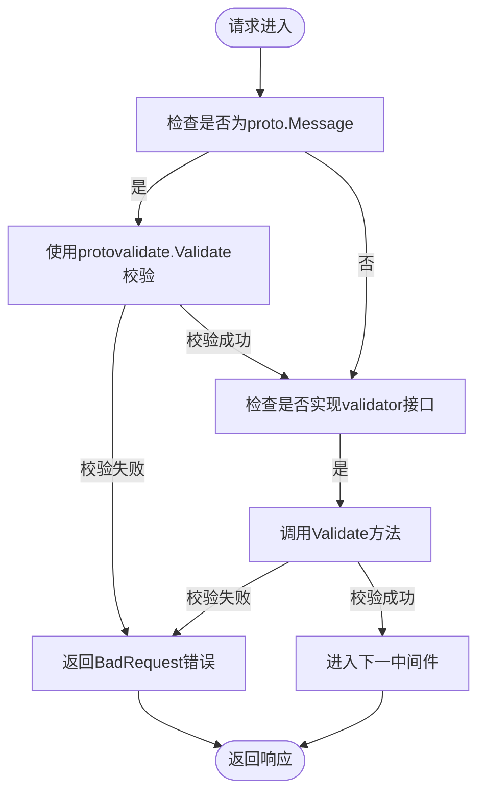
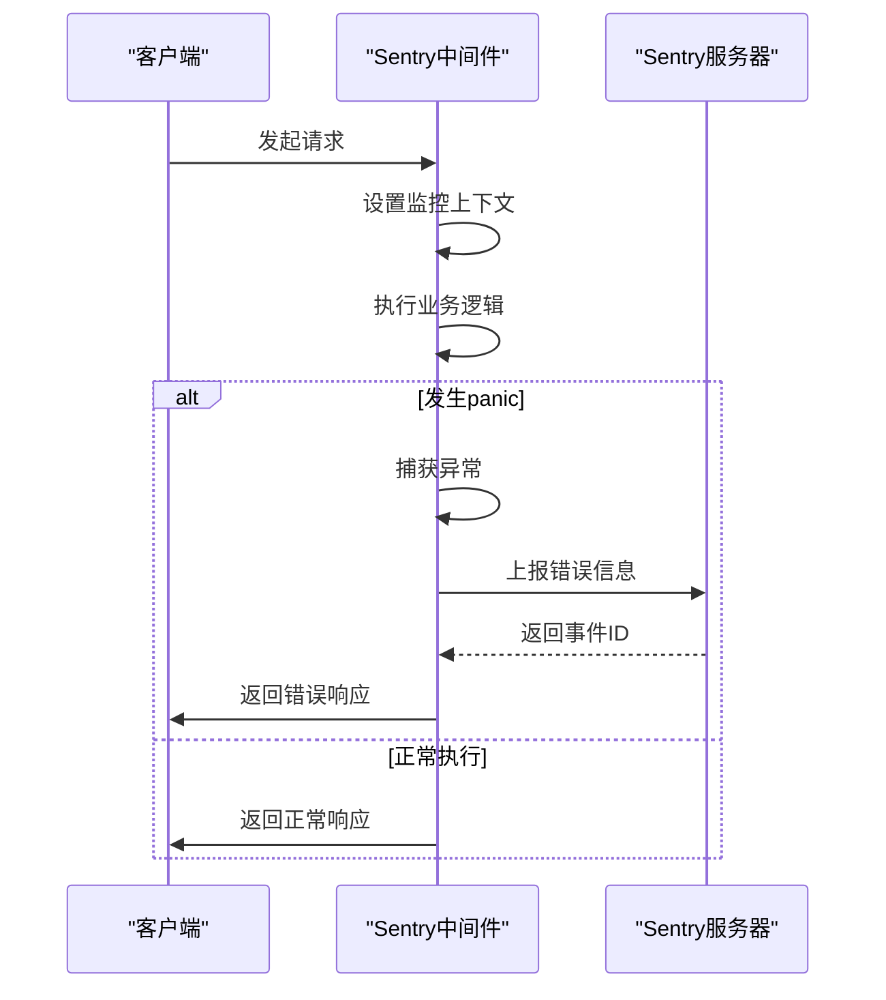
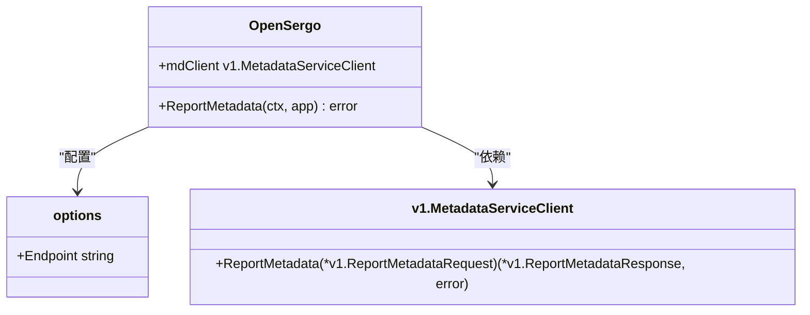
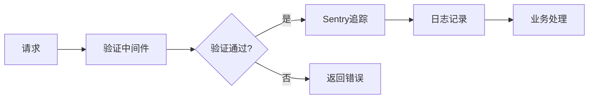

# 中间件扩展

<cite>
**本文档中引用的文件**  
- [validate.go](file://contrib/middleware/validate/validate.go)
- [sentry.go](file://contrib/errortracker/sentry/sentry.go)
- [limiter.go](file://contrib/polaris/limiter.go)
- [router.go](file://contrib/polaris/router.go)
- [polaris.go](file://contrib/polaris/polaris.go)
- [opensergo.go](file://contrib/opensergo/opensergo.go)
- [middleware.go](file://middleware/middleware.go)
- [config.go](file://contrib/polaris/config.go)
- [registry.go](file://contrib/registry/polaris/registry.go)
- [recovery.go](file://middleware/recovery/recovery.go)
- [logging.go](file://middleware/logging/logging.go)
- [tracing.go](file://middleware/tracing/tracing.go)
- [README.md](file://contrib/middleware/validate/README.md)
</cite>

## 目录
1. [引言](#引言)
2. [核心中间件功能](#核心中间件功能)
3. [验证中间件](#验证中间件)
4. [Sentry错误追踪中间件](#sentry错误追踪中间件)
5. [OpenSergo服务治理](#opensergo服务治理)
6. [Polaris服务治理](#polaris服务治理)
7. [中间件执行顺序与协作](#中间件执行顺序与协作)
8. [自定义中间件开发指南](#自定义中间件开发指南)
9. [结论](#结论)

## 引言
Kratos框架通过contrib模块提供了丰富的中间件扩展，支持多种服务治理标准和增强功能。这些中间件基于Go语言的函数式编程范式，通过组合模式实现灵活的请求处理链。本文档详细介绍了validate、sentry、opensergo和polaris等关键中间件的实现原理和使用方法。

## 核心中间件功能

Kratos中间件系统基于函数式设计模式，所有中间件都遵循统一的函数签名：

```go
type Handler func(ctx context.Context, req any) (any, error)
type Middleware func(Handler) Handler
```

中间件通过Chain函数进行组合，形成处理链。执行顺序遵循后进先出原则，即最后添加的中间件最先执行。这种设计模式使得中间件可以灵活组合，实现关注点分离。

**Section sources**
- [middleware.go](file://middleware/middleware.go#L7-L22)

## 验证中间件

### Protobuf验证实现

validate中间件利用Protobuf的验证规则实现请求参数校验。它支持两种验证模式：基于protovalidate的现代模式和兼容旧版的legacy模式。



**Diagram sources**
- [validate.go](file://contrib/middleware/validate/validate.go#L13-L38)

### 错误码与响应格式

验证失败时，中间件生成标准化的错误响应：

```go
errors.BadRequest("VALIDATOR", err.Error()).WithCause(err)
```

错误码为"VALIDATOR"，消息内容包含具体的验证错误信息。这种设计确保了客户端能够获得清晰的错误反馈，便于调试和处理。

**Section sources**
- [validate.go](file://contrib/middleware/validate/validate.go#L23-L30)
- [README.md](file://contrib/middleware/validate/README.md#L1-L16)

## Sentry错误追踪中间件

### 异常捕获机制

Sentry中间件通过defer和recover机制捕获运行时panic，确保服务的稳定性：

```go
defer recoverWithSentry(ctx, conf, hub, req)
return handler(ctx, req)
```

捕获到panic后，中间件会将其上报到Sentry服务器，同时根据配置决定是否重新抛出异常。

### 上下文收集

中间件自动收集请求上下文信息，包括：

- gRPC调用的endpoint和operation
- HTTP请求的完整信息
- 自定义标签（通过WithTags选项）

```go
if tr, ok := transport.FromServerContext(ctx); ok {
    switch tr.Kind() {
    case transport.KindGRPC:
        // 收集gRPC上下文
    case transport.KindHTTP:
        // 收集HTTP上下文
    }
}
```

### 远程上报

上报过程支持配置超时和等待交付：

```go
if eventID != nil && opts.waitForDelivery {
    hub.Flush(opts.timeout)
}
```

这确保了关键错误信息不会丢失，即使在服务快速退出的情况下。



**Diagram sources**
- [sentry.go](file://contrib/errortracker/sentry/sentry.go#L68-L105)
- [sentry.go](file://contrib/errortracker/sentry/sentry.go#L109-L123)

**Section sources**
- [sentry.go](file://contrib/errortracker/sentry/sentry.go#L1-L146)

## OpenSergo服务治理

### 流量路由实现

OpenSergo中间件通过gRPC与OpenSergo控制平面通信，获取服务契约和路由规则：

```go
func (s *OpenSergo) ReportMetadata(ctx context.Context, app kratos.AppInfo) error {
    services, types, err := listDescriptors()
    // ...
    return s.mdClient.ReportMetadata(ctx, &v1.ReportMetadataRequest{
        AppName:         app.Name(),
        ServiceMetadata: []*v1.ServiceMetadata{serviceMetadata},
    })
}
```

### 熔断降级

通过服务契约发现机制，实现基于规则的熔断降级策略。当服务调用失败率达到阈值时，自动切换到降级逻辑。



**Diagram sources**
- [opensergo.go](file://contrib/opensergo/opensergo.go#L40-L205)

**Section sources**
- [opensergo.go](file://contrib/opensergo/opensergo.go#L1-L205)

## Polaris服务治理

### 限流中间件

Polaris限流基于polaris-go SDK实现，支持多种限流算法：

```go
func (l *Limiter) Allow(method string, argument ...model.Argument) (ratelimit.DoneFunc, error) {
    request := buildRequest(l.opts)
    request.SetMethod(method)
    for _, arg := range argument {
        request.AddArgument(arg)
    }
    resp, err := l.limitAPI.GetQuota(request)
    // ...
}
```

### 路由中间件

动态路由通过Polaris的路由规则引擎实现：

```go
func (p *Polaris) NodeFilter(opts ...RouterOption) selector.NodeFilter {
    // 构建路由请求
    req := &polaris.ProcessRoutersRequest{
        SourceService: model.ServiceInfo{Namespace: p.namespace, Service: o.service},
        DstInstances:  buildPolarisInstance(p.namespace, nodes),
    }
    // 处理传输层信息
    if tr, ok := transport.FromClientContext(ctx); ok {
        req.AddArguments(model.BuildMethodArgument(tr.Operation()))
        // ...
    }
    // 执行路由
    m, err := p.router.ProcessRouters(req)
    // ...
}
```

```mermaid
graph TB
subgraph "客户端"
Router[路由中间件]
end
subgraph "服务发现"
PolarisServer[Polaris服务器]
end
subgraph "服务实例"
InstanceA[实例A]
InstanceB[实例B]
InstanceC[实例C]
end
Router --> PolarisServer : "查询路由规则"
PolarisServer --> Router : "返回过滤后的实例列表"
Router --> InstanceA
Router --> InstanceB
```

**Diagram sources**
- [limiter.go](file://contrib/polaris/limiter.go#L70-L106)
- [router.go](file://contrib/polaris/router.go#L23-L145)

**Section sources**
- [polaris.go](file://contrib/polaris/polaris.go#L1-L102)
- [limiter.go](file://contrib/polaris/limiter.go#L1-L106)
- [router.go](file://contrib/polaris/router.go#L1-L145)
- [config.go](file://contrib/polaris/config.go#L1-L121)
- [registry.go](file://contrib/registry/polaris/registry.go#L1-L444)

## 中间件执行顺序与协作

### 执行顺序控制

通过Chain函数控制中间件执行顺序：

```go
middleware.Chain(
    validate.ProtoValidate(),
    sentry.Server(),
    tracing.Server(),
    logging.Server(logger),
)
```

执行顺序为：validate → sentry → tracing → logging。

### 中间件协作

验证失败后不进入追踪链路的设计：

```go
// 验证中间件中，验证失败直接返回，不调用handler
if err := protovalidate.Validate(msg); err != nil {
    return nil, errors.BadRequest("VALIDATOR", err.Error()).WithCause(err)
}
// 只有验证通过才继续执行
return handler(ctx, req)
```

这种设计避免了无效请求进入后续的追踪和日志记录，提高了系统效率。



**Section sources**
- [middleware.go](file://middleware/middleware.go#L14-L21)
- [validate.go](file://contrib/middleware/validate/validate.go#L19-L34)

## 自定义中间件开发指南

### Middleware函数签名

所有中间件必须遵循统一的函数签名：

```go
func MyMiddleware() middleware.Middleware {
    return func(handler middleware.Handler) middleware.Handler {
        return func(ctx context.Context, req any) (reply any, err error) {
            // 前置处理
            reply, err = handler(ctx, req)
            // 后置处理
            return reply, err
        }
    }
}
```

### 错误处理

遵循Kratos的错误处理规范：

```go
import "github.com/go-kratos/kratos/v2/errors"

// 创建标准化错误
err := errors.BadRequest("VALIDATION", "invalid parameter")
```

### 性能监控埋点

在关键路径添加性能监控：

```go
startTime := time.Now()
defer func() {
    latency := time.Since(startTime)
    // 上报监控指标
}()
```

结合tracing中间件，可以实现完整的调用链追踪。

**Section sources**
- [middleware.go](file://middleware/middleware.go#L7-L22)
- [recovery.go](file://middleware/recovery/recovery.go#L47-L60)
- [logging.go](file://middleware/logging/logging.go#L24-L58)
- [tracing.go](file://middleware/tracing/tracing.go#L49-L58)

## 结论
Kratos框架的中间件扩展体系提供了完整的微服务治理能力。通过validate实现请求验证，sentry提供错误追踪，opensergo和polaris支持服务治理标准。这些中间件通过函数式组合，形成了灵活、可扩展的处理链。开发者可以基于统一的中间件模式，轻松实现自定义功能，满足特定业务需求。