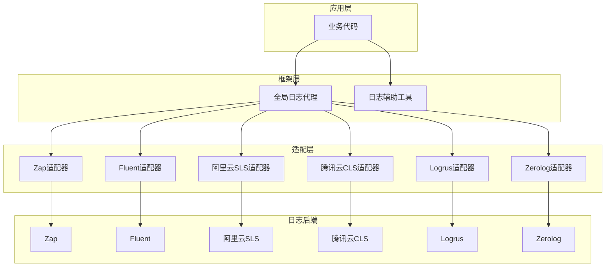
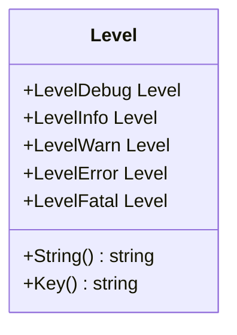

# 日志系统集成

<cite>
**本文档中引用的文件**  
- [log.go](file://log/log.go)
- [global.go](file://log/global.go)
- [level.go](file://log/level.go)
- [helper.go](file://log/helper.go)
- [filter.go](file://log/filter.go)
- [std.go](file://log/std.go)
- [zap.go](file://contrib/log/zap/zap.go)
- [fluent.go](file://contrib/log/fluent/fluent.go)
- [aliyun.go](file://contrib/log/aliyun/aliyun.go)
- [tencent.go](file://contrib/log/tencent/tencent.go)
- [logrus.go](file://contrib/log/logrus/logrus.go)
- [zerolog.go](file://contrib/log/zerolog/zerolog.go)
- [logging.go](file://middleware/logging/logging.go)
</cite>

## 目录
1. [简介](#简介)
2. [核心架构与设计](#核心架构与设计)
3. [日志接口与适配器模式](#日志接口与适配器模式)
4. [日志级别与消息键](#日志级别与消息键)
5. [具体日志后端适配实现](#具体日志后端适配实现)
   - [Zap日志适配](#zap日志适配)
   - [Fluent日志适配](#fluent日志适配)
   - [阿里云SLS日志适配](#阿里云sls日志适配)
   - [腾讯云CLS日志适配](#腾讯云cls日志适配)
   - [Logrus日志适配](#logrus日志适配)
   - [Zerolog日志适配](#zerolog日志适配)
6. [日志辅助工具与上下文传递](#日志辅助工具与上下文传递)
7. [日志过滤与脱敏](#日志过滤与脱敏)
8. [中间件中的日志应用](#中间件中的日志应用)
9. [性能优化与高并发策略](#性能优化与高并发策略)
10. [接入其他日志系统的开发指南](#接入其他日志系统的开发指南)

## 简介
Kratos框架提供了一套灵活、可扩展的日志系统，通过`contrib/log`模块支持多种日志后端的集成。该系统采用适配器模式，将框架内部的标准日志接口映射到不同的日志库，如Zap、Fluent、阿里云SLS、腾讯云CLS、Logrus和Zerolog等。本文档详细介绍了这些日志后端的适配实现，包括日志条目转换、结构化输出、异步写入和性能优化技巧。同时，文档还涵盖了配置参数、连接池设置、网络传输加密、日志级别映射、上下文字段传递、分布式追踪ID注入等关键功能的实现细节，并提供了高并发场景下的日志采样和限流策略，以及接入其他日志系统的开发指南。

## 核心架构与设计
Kratos日志系统的核心设计基于接口抽象和适配器模式。系统定义了一个统一的`Logger`接口，所有具体的日志实现都必须遵循此接口。通过`SetLogger`函数，可以将全局日志实例设置为任意实现了该接口的适配器。这种设计使得应用可以在不修改业务代码的情况下，灵活切换不同的日志后端。



**Diagram sources**
- [log.go](file://log/log.go#L11-L14)
- [global.go](file://log/global.go#L10-L18)

## 日志接口与适配器模式
Kratos日志系统的核心是`Logger`接口，它定义了所有日志实现必须提供的基本方法。该接口非常简洁，只有一个`Log`方法，接受日志级别和键值对作为参数。

```go
type Logger interface {
    Log(level Level, keyvals ...any) error
}
```

这种设计使得日志系统非常灵活，可以轻松地适配各种日志库。每个具体的日志后端都通过实现这个接口来提供服务。适配器负责将Kratos框架的日志调用转换为具体日志库的API调用。

**Section sources**
- [log.go](file://log/log.go#L11-L14)

## 日志级别与消息键
Kratos框架定义了标准的日志级别，包括DEBUG、INFO、WARN、ERROR和FATAL。这些级别通过`Level`类型和相应的常量来表示。日志级别不仅用于控制日志的输出，还可以用于过滤和路由。



**Diagram sources**
- [level.go](file://log/level.go#L6-L22)

此外，框架还定义了默认的消息键（`DefaultMessageKey`），通常为"msg"，用于在结构化日志中标识日志消息内容。日志级别键（`LevelKey`）默认为"level"。

**Section sources**
- [level.go](file://log/level.go#L8-L61)
- [helper.go](file://log/helper.go#L9-L10)

## 具体日志后端适配实现

### Zap日志适配
Zap是Uber开源的高性能日志库，Kratos通过`contrib/log/zap`包提供了对其的适配。适配器将Kratos的日志调用转换为Zap的结构化日志调用，支持异步写入和各种编码格式。

```go
func (l *Logger) Log(level log.Level, keyvals ...any) error {
    // ...
    switch level {
    case log.LevelDebug:
        l.log.Debug(msg, data...)
    case log.LevelInfo:
        l.log.Info(msg, data...)
    // ...
    }
    return nil
}
```

适配器还提供了`WithMessageKey`选项，允许用户自定义消息键。

**Section sources**
- [zap.go](file://contrib/log/zap/zap.go#L14-L81)

### Fluent日志适配
Fluent适配器允许将日志发送到Fluentd或Fluent Bit等日志收集系统。它支持TCP和Unix域套接字连接，并提供了丰富的配置选项，如超时、缓冲区大小、重试策略等。

```go
func NewLogger(addr string, opts ...Option) (*Logger, error) {
    // ...
    switch u.Scheme {
    case "tcp":
        // ...
    case "unix":
        // ...
    }
    // ...
}
```

适配器将日志条目转换为Fluentd的事件格式，并通过`Post`方法发送。

**Section sources**
- [fluent.go](file://contrib/log/fluent/fluent.go#L96-L178)

### 阿里云SLS日志适配
阿里云SLS适配器通过`aliyun-log-go-sdk`与阿里云日志服务集成。它使用生产者模式异步发送日志，支持高吞吐量和可靠性。

```go
func (a *aliyunLog) Log(level log.Level, keyvals ...any) error {
    contents := make([]*sls.LogContent, 0, len(keyvals)/2+1)
    contents = append(contents, &sls.LogContent{
        Key:   newString(level.Key()),
        Value: newString(level.String()),
    })
    for i := 0; i < len(keyvals); i += 2 {
        contents = append(contents, &sls.LogContent{
            Key:   newString(toString(keyvals[i])),
            Value: newString(toString(keyvals[i+1])),
        })
    }
    logInst := &sls.Log{
        Time:     proto.Uint32(uint32(time.Now().Unix())),
        Contents: contents,
    }
    return a.producer.SendLog(a.opts.project, a.opts.logstore, "", "", logInst)
}
```

配置选项包括项目名称、日志库名称、访问密钥和端点等。

**Section sources**
- [aliyun.go](file://contrib/log/aliyun/aliyun.go#L24-L178)

### 腾讯云CLS日志适配
腾讯云CLS适配器与阿里云SLS类似，使用`tencentcloud-cls-sdk-go`与腾讯云日志服务集成。它同样采用异步生产者模式，确保日志的高效和可靠传输。

```go
func (log *tencentLog) Log(level log.Level, keyvals ...any) error {
    contents := make([]*cls.Log_Content, 0, len(keyvals)/2+1)
    contents = append(contents, &cls.Log_Content{
        Key:   newString(level.Key()),
        Value: newString(level.String()),
    })
    for i := 0; i < len(keyvals); i += 2 {
        contents = append(contents, &cls.Log_Content{
            Key:   newString(toString(keyvals[i])),
            Value: newString(toString(keyvals[i+1])),
        })
    }
    logInst := &cls.Log{
        Time:     proto.Int64(time.Now().Unix()),
        Contents: contents,
    }
    return log.producer.SendLog(log.opts.topicID, logInst, nil)
}
```

主要配置参数包括主题ID、访问密钥和端点。

**Section sources**
- [tencent.go](file://contrib/log/tencent/tencent.go#L22-L162)

### Logrus日志适配
Logrus是Go语言中最流行的日志库之一，Kratos通过简单的适配器将其集成。适配器将Kratos的日志级别映射到Logrus的级别，并将键值对转换为Logrus的字段。

```go
func (l *Logger) Log(level log.Level, keyvals ...any) (err error) {
    var (
        logrusLevel logrus.Level
        fields      logrus.Fields = make(map[string]any)
        msg         string
    )
    switch level {
    case log.LevelDebug:
        logrusLevel = logrus.DebugLevel
    // ...
    }
    // ...
    if len(fields) > 0 {
        l.log.WithFields(fields).Log(logrusLevel, msg)
    } else {
        l.log.Log(logrusLevel, msg)
    }
    return
}
```

**Section sources**
- [logrus.go](file://contrib/log/logrus/logrus.go#L11-L73)

### Zerolog日志适配
Zerolog是一个零分配的JSON日志库，以其高性能著称。Kratos的适配器充分利用了Zerolog的链式调用特性，将日志条目高效地转换为JSON格式。

```go
func (l *Logger) Log(level log.Level, keyvals ...any) (err error) {
    var event *zerolog.Event
    switch level {
    case log.LevelDebug:
        event = l.log.Debug()
    // ...
    }
    for i := 0; i < len(keyvals); i += 2 {
        key, ok := keyvals[i].(string)
        if !ok {
            continue
        }
        event = event.Any(key, keyvals[i+1])
    }
    event.Send()
    return
}
```

**Section sources**
- [zerolog.go](file://contrib/log/zerolog/zerolog.go#L11-L55)

## 日志辅助工具与上下文传递
Kratos提供了`Helper`工具类来简化日志记录。`Helper`封装了常用的日志方法，如`Debug`、`Info`、`Warn`等，并支持上下文传递。

```go
func (h *Helper) WithContext(ctx context.Context) *Helper {
    return &Helper{
        msgKey:  h.msgKey,
        logger:  WithContext(ctx, h.logger),
        sprint:  h.sprint,
        sprintf: h.sprintf,
    }
}
```

通过`WithContext`方法，可以将上下文信息注入到日志中，这对于分布式追踪和请求链路跟踪非常有用。

**Section sources**
- [helper.go](file://log/helper.go#L60-L67)

## 日志过滤与脱敏
Kratos日志系统提供了`Filter`功能，允许对日志进行过滤和脱敏。可以通过设置过滤级别、关键字或自定义过滤函数来控制日志的输出。

```go
func NewFilter(logger Logger, opts ...FilterOption) *Filter {
    options := Filter{
        logger: logger,
        key:    make(map[any]struct{}),
        value:  make(map[any]struct{}),
    }
    for _, o := range opts {
        o(&options)
    }
    return &options
}
```

当检测到敏感信息时，过滤器会将其替换为模糊字符串（`***`），从而保护用户隐私和系统安全。

**Section sources**
- [filter.go](file://log/filter.go#L40-L95)

## 中间件中的日志应用
在Kratos的中间件中，日志被广泛用于记录请求和响应的详细信息。例如，`logging`中间件会记录每个请求的操作类型、参数、执行时间、错误码等。

```go
func Server(logger log.Logger) middleware.Middleware {
    return func(handler middleware.Handler) middleware.Handler {
        return func(ctx context.Context, req any) (reply any, err error) {
            startTime := time.Now()
            // ...
            reply, err = handler(ctx, req)
            // ...
            log.NewHelper(log.WithContext(ctx, logger)).Log(level,
                "kind", "server",
                "component", kind,
                "operation", operation,
                "args", extractArgs(req),
                "code", code,
                "reason", reason,
                "stack", stack,
                "latency", time.Since(startTime).Seconds(),
            )
            return
        }
    }
}
```

这种设计使得系统具有良好的可观测性，便于问题排查和性能分析。

**Section sources**
- [logging.go](file://middleware/logging/logging.go#L23-L120)

## 性能优化与高并发策略
Kratos日志系统在设计时充分考虑了性能因素。通过使用`sync.Pool`来复用缓冲区，避免了频繁的内存分配。对于高吞吐量的日志后端，如阿里云SLS和腾讯云CLS，采用了异步生产者模式，将日志发送与业务逻辑解耦。

在高并发场景下，建议使用异步日志适配器，并合理配置缓冲区大小和批处理策略。此外，可以通过设置日志级别和过滤规则来减少不必要的日志输出，从而降低系统开销。

## 接入其他日志系统的开发指南
要接入新的日志系统，开发者需要实现`Logger`接口，并提供相应的适配器。适配器应处理日志级别映射、键值对转换、错误处理等。建议参考现有适配器的实现，如Zap或Fluent，以确保一致性和兼容性。

性能基准测试是评估新适配器的重要环节。可以通过`testing.B`进行压力测试，比较不同适配器在高并发下的性能表现。测试时应关注CPU使用率、内存分配和日志延迟等指标。