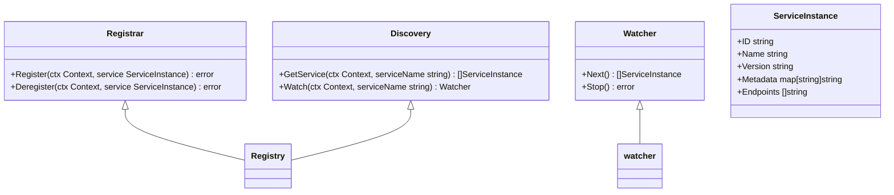

# 注册中心集成

<cite>
**本文档引用的文件**   
- [registry.go](file://registry/registry.go)
- [etcd/registry.go](file://contrib/registry/etcd/registry.go)
- [consul/registry.go](file://contrib/registry/consul/registry.go)
- [nacos/registry.go](file://contrib/registry/nacos/registry.go)
- [kubernetes/registry.go](file://contrib/registry/kubernetes/registry.go)
- [eureka/eureka.go](file://contrib/registry/eureka/eureka.go)
- [zookeeper/register.go](file://contrib/registry/zookeeper/register.go)
- [servicecomb/registry.go](file://contrib/registry/servicecomb/registry.go)
- [polaris/registry.go](file://contrib/registry/polaris/registry.go)
- [etcd/watcher.go](file://contrib/registry/etcd/watcher.go)
- [consul/watcher.go](file://contrib/registry/consul/watcher.go)
- [nacos/watcher.go](file://contrib/registry/nacos/watcher.go)
- [zookeeper/watcher.go](file://contrib/registry/zookeeper/watcher.go)
- [servicecomb/watcher.go](file://contrib/registry/servicecomb/watcher.go)
- [eureka/watcher.go](file://contrib/registry/eureka/watcher.go)
</cite>

## 目录
1. [介绍](#介绍)
2. [核心接口与数据结构](#核心接口与数据结构)
3. 主流注册中心实现
   1. [etcd集成](#etcd集成)
   2. [Consul集成](#consul集成)
   3. [Nacos集成](#nacos集成)
   4. [Kubernetes集成](#kubernetes集成)
   5. [Eureka集成](#eureka集成)
   6. [Zookeeper集成](#zookeeper集成)
   7. [ServiceComb集成](#servicecomb集成)
   8. [Polaris集成](#polaris集成)
4. [服务监听机制](#服务监听机制)
5. [常见问题排查](#常见问题排查)
6. [自定义注册中心](#自定义注册中心)

## 介绍

Kratos框架通过`contrib/registry`模块提供了与主流服务注册中心的集成能力。该模块实现了统一的注册发现接口，允许开发者将服务注册到etcd、Consul、Nacos、Kubernetes、Eureka、Zookeeper、ServiceComb和Polaris等注册中心。本文档详细介绍了这些注册中心的实现机制、配置方式、初始化代码示例和最佳实践。

**Section sources**
- [registry.go](file://registry/registry.go)

## 核心接口与数据结构

Kratos框架定义了`Registrar`、`Discovery`和`Watcher`三个核心接口来实现服务注册与发现功能。`ServiceInstance`结构体用于描述服务实例的元数据。

**Diagram sources**
- [registry.go](file://registry/registry.go)

## 主流注册中心实现

### etcd集成

etcd注册中心通过租约(Lease)机制实现服务注册和心跳保活。服务注册时创建带TTL的键值对，通过`KeepAlive`维持租约。当服务下线时，租约过期自动删除服务实例。

**Diagram sources**
- [etcd/registry.go](file://contrib/registry/etcd/registry.go)
- [etcd/watcher.go](file://contrib/registry/etcd/watcher.go)

**Section sources**
- [etcd/registry.go](file://contrib/registry/etcd/registry.go)

### Consul集成

Consul注册中心支持健康检查和心跳机制。通过`WithHealthCheck`选项可以启用或禁用健康检查，`WithHeartbeat`选项控制是否发送心跳。服务注册时可以配置服务标签和检查项。

**Diagram sources**
- [consul/registry.go](file://contrib/registry/consul/registry.go)
- [consul/watcher.go](file://contrib/registry/consul/watcher.go)

**Section sources**
- [consul/registry.go](file://contrib/registry/consul/registry.go)

### Nacos集成

Nacos注册中心将服务实例的元数据存储在Nacos服务器中。服务注册时会解析端点URL，提取协议、主机和端口信息，并将服务实例注册到Nacos。支持通过`WithWeight`、`WithCluster`等选项配置服务权重和集群信息。

**Diagram sources**
- [nacos/registry.go](file://contrib/registry/nacos/registry.go)
- [nacos/watcher.go](file://contrib/registry/nacos/watcher.go)

**Section sources**
- [nacos/registry.go](file://contrib/registry/nacos/registry.go)

### Kubernetes集成

Kubernetes注册中心通过Pod标签和注解来管理服务元数据。服务注册实际上是更新Pod的标签和注解，包括服务ID、名称、版本、元数据和协议映射等信息。服务发现通过监听Pod变化来实现。

**Diagram sources**
- [kubernetes/registry.go](file://contrib/registry/kubernetes/registry.go)

**Section sources**
- [kubernetes/registry.go](file://contrib/registry/kubernetes/registry.go)

### Eureka集成

Eureka注册中心通过REST API与Eureka服务器通信。服务注册时会向Eureka服务器发送注册请求，并启动心跳协程定期发送心跳。服务发现通过订阅机制获取服务实例列表的变化。

**Diagram sources**
- [eureka/eureka.go](file://contrib/registry/eureka/eureka.go)
- [eureka/watcher.go](file://contrib/registry/eureka/watcher.go)

**Section sources**
- [eureka/eureka.go](file://contrib/registry/eureka/eureka.go)

### Zookeeper集成

Zookeeper注册中心使用临时节点来表示服务实例。服务注册时创建临时节点存储服务实例信息，当服务下线时节点自动删除。通过`ChildrenW`监听子节点变化来实现服务发现。

**Diagram sources**
- [zookeeper/register.go](file://contrib/registry/zookeeper/register.go)
- [zookeeper/watcher.go](file://contrib/registry/zookeeper/watcher.go)

**Section sources**
- [zookeeper/register.go](file://contrib/registry/zookeeper/register.go)

### ServiceComb集成

ServiceComb注册中心通过`sc-client`与ServiceComb服务器通信。服务注册时先注册微服务定义，再注册微服务实例，并启动心跳协程。服务发现通过`WatchMicroService`监听服务实例变化。

**Diagram sources**
- [servicecomb/registry.go](file://contrib/registry/servicecomb/registry.go)
- [servicecomb/watcher.go](file://contrib/registry/servicecomb/watcher.go)

**Section sources**
- [servicecomb/registry.go](file://contrib/registry/servicecomb/registry.go)

### Polaris集成

Polaris注册中心通过`polaris-go` SDK与Polaris服务器通信。服务注册时调用`Register`接口注册实例，并根据配置决定是否启动心跳上报。服务发现通过`GetAllInstances`获取实例列表。

**Diagram sources**
- [polaris/registry.go](file://contrib/registry/polaris/registry.go)

**Section sources**
- [polaris/registry.go](file://contrib/registry/polaris/registry.go)

## 服务监听机制

不同注册中心的监听机制有所不同，但都实现了`Watcher`接口的`Next()`方法，用于获取服务实例列表的变化。

**Diagram sources**
- [etcd/watcher.go](file://contrib/registry/etcd/watcher.go)
- [consul/watcher.go](file://contrib/registry/consul/watcher.go)
- [nacos/watcher.go](file://contrib/registry/nacos/watcher.go)
- [zookeeper/watcher.go](file://contrib/registry/zookeeper/watcher.go)
- [servicecomb/watcher.go](file://contrib/registry/servicecomb/watcher.go)
- [eureka/watcher.go](file://contrib/registry/eureka/watcher.go)

**Section sources**
- [etcd/watcher.go](file://contrib/registry/etcd/watcher.go)
- [consul/watcher.go](file://contrib/registry/consul/watcher.go)
- [nacos/watcher.go](file://contrib/registry/nacos/watcher.go)
- [zookeeper/watcher.go](file://contrib/registry/zookeeper/watcher.go)
- [servicecomb/watcher.go](file://contrib/registry/servicecomb/watcher.go)
- [eureka/watcher.go](file://contrib/registry/eureka/watcher.go)

## 常见问题排查

### 服务未注册

- 检查注册中心连接配置是否正确
- 确认服务实例的ID、名称等必填字段是否设置
- 查看日志是否有注册失败的错误信息
- 验证注册中心服务器是否正常运行

### 心跳失败

- 检查网络连接是否正常
- 确认租约TTL或心跳间隔设置是否合理
- 查看注册中心服务器负载是否过高
- 验证客户端与服务器时间是否同步

### 服务列表不更新

- 检查监听是否正常建立
- 确认服务变化事件是否被正确推送
- 查看是否有网络分区导致通信中断
- 验证客户端缓存机制是否正常工作

**Section sources**
- [etcd/registry.go](file://contrib/registry/etcd/registry.go)
- [consul/registry.go](file://contrib/registry/consul/registry.go)
- [nacos/registry.go](file://contrib/registry/nacos/registry.go)

## 自定义注册中心

要实现自定义注册中心，需要实现`Registrar`、`Discovery`和`Watcher`三个接口。`Register`方法负责服务注册，`Deregister`方法负责服务注销，`GetService`方法获取服务实例列表，`Watch`方法创建服务监听器。

**Diagram sources**
- [registry.go](file://registry/registry.go)

**Section sources**
- [registry.go](file://registry/registry.go)