# 配置中心集成

<cite>
**本文档引用的文件**
- [config.go](file://config/config.go)
- [source.go](file://config/source.go)
- [reader.go](file://config/reader.go)
- [options.go](file://config/options.go)
- [value.go](file://config/value.go)
- [apollo/apollo.go](file://contrib/config/apollo/apollo.go)
- [apollo/watcher.go](file://contrib/config/apollo/watcher.go)
- [consul/config.go](file://contrib/config/consul/config.go)
- [consul/watcher.go](file://contrib/config/consul/watcher.go)
- [etcd/config.go](file://contrib/config/etcd/config.go)
- [etcd/watcher.go](file://contrib/config/etcd/watcher.go)
- [kubernetes/config.go](file://contrib/config/kubernetes/config.go)
- [kubernetes/watcher.go](file://contrib/config/kubernetes/watcher.go)
- [nacos/config.go](file://contrib/config/nacos/config.go)
- [nacos/watcher.go](file://contrib/config/nacos/watcher.go)
- [polaris/config.go](file://contrib/config/polaris/config.go)
</cite>

## 目录
1. [架构概述](#架构概述)
2. [核心组件分析](#核心组件分析)
3. [配置源接入方式](#配置源接入方式)
4. [配置拉取与监听机制](#配置拉取与监听机制)
5. [格式解析与本地缓存](#格式解析与本地缓存)
6. [多配置源组合使用](#多配置源组合使用)
7. [配置热更新流程](#配置热更新流程)
8. [高延迟网络处理](#高延迟网络处理)
9. [新配置源插件开发](#新配置源插件开发)

## 架构概述

Kratos框架的配置中心集成通过`contrib/config`模块实现了动态配置管理，其核心架构基于观察者模式和接口抽象，提供了灵活的配置源接入能力。系统主要由配置管理器、配置源、读取器、观察者等组件构成，形成了一个完整的配置生命周期管理闭环。

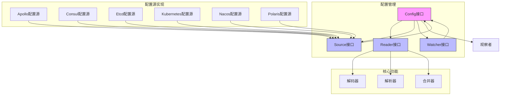

**图示来源**
- [config.go](file://config/config.go#L27-L34)
- [source.go](file://config/source.go#L10-L20)

## 核心组件分析

配置中心的核心组件包括配置管理接口、配置源接口、读取器和值对象等，它们共同协作完成配置的加载、解析、监听和应用。

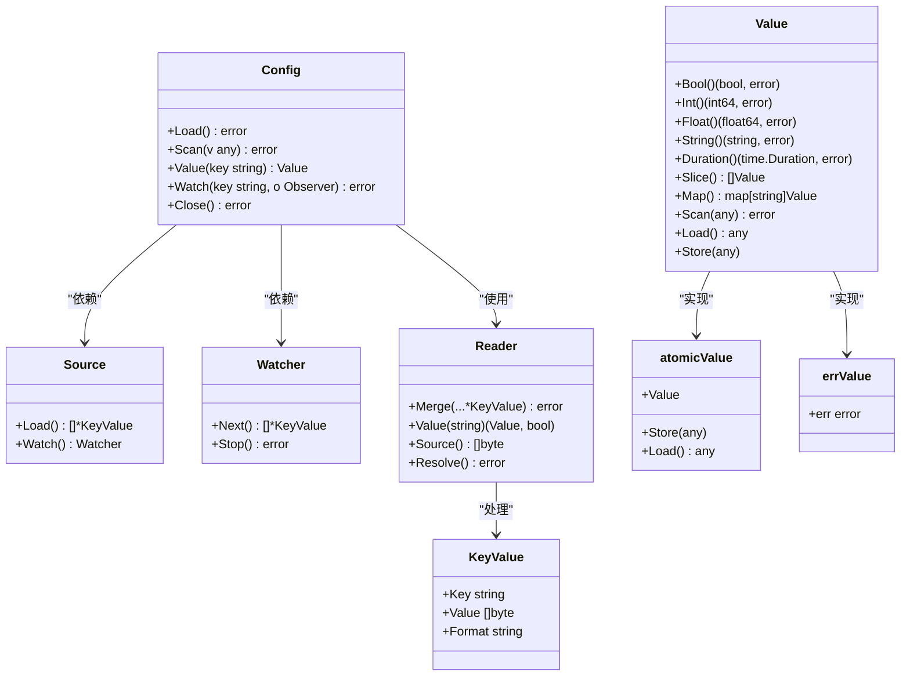

**图示来源**
- [config.go](file://config/config.go#L27-L34)
- [source.go](file://config/source.go#L10-L20)
- [reader.go](file://config/reader.go#L17-L22)
- [value.go](file://config/value.go#L21-L33)

**本节来源**
- [config.go](file://config/config.go#L27-L158)
- [source.go](file://config/source.go#L10-L20)
- [reader.go](file://config/reader.go#L17-L22)
- [value.go](file://config/value.go#L21-L33)

## 配置源接入方式

Kratos框架通过`contrib/config`模块提供了对多种配置中心的支持，包括Apollo、Consul、Etcd、Kubernetes ConfigMap、Nacos和Polaris等。每种配置源都实现了统一的`Source`接口，确保了配置管理的一致性。

### Apollo配置源

Apollo配置源通过`NewSource`函数创建，支持多种配置选项，包括AppID、集群、命名空间、端点等。配置源支持从多个命名空间加载配置，并能处理YAML、JSON等格式的配置文件。

**初始化参数：**
- `WithAppID`: 设置应用ID
- `WithCluster`: 设置集群名称
- `WithEndpoint`: 设置配置服务器地址
- `WithNamespace`: 设置命名空间
- `WithSecret`: 设置应用密钥
- `WithOriginalConfig`: 使用原始配置文件

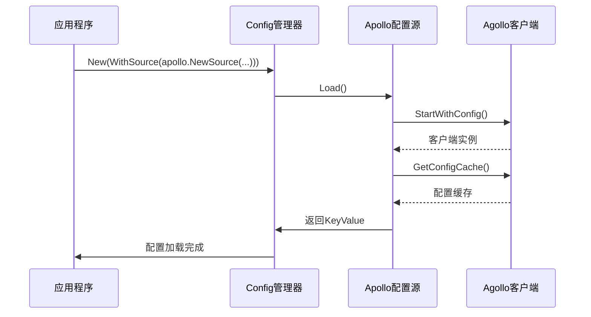

**图示来源**
- [apollo/apollo.go](file://contrib/config/apollo/apollo.go#L110-L129)
- [apollo/watcher.go](file://contrib/config/apollo/watcher.go#L74-L88)

### Consul配置源

Consul配置源通过`New`函数创建，需要提供Consul客户端实例和配置路径。配置源支持从指定路径下加载所有键值对，并能根据文件扩展名自动识别配置格式。

**初始化参数：**
- `WithContext`: 设置上下文
- `WithPath`: 设置配置路径

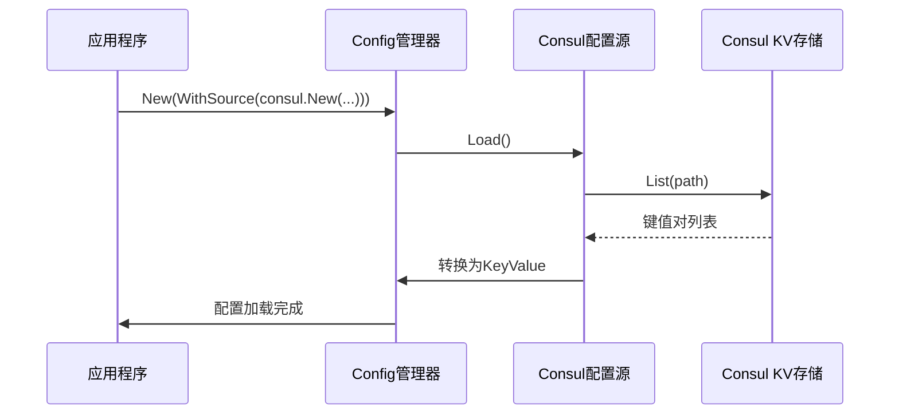

**图示来源**
- [consul/config.go](file://contrib/config/consul/config.go#L41-L58)
- [consul/watcher.go](file://contrib/config/consul/watcher.go#L61-L87)

### Etcd配置源

Etcd配置源通过`New`函数创建，需要提供Etcd客户端实例和配置路径。配置源支持前缀匹配模式，可以从指定路径或其子路径下加载配置。

**初始化参数：**
- `WithContext`: 设置上下文
- `WithPath`: 设置配置路径
- `WithPrefix`: 设置前缀匹配

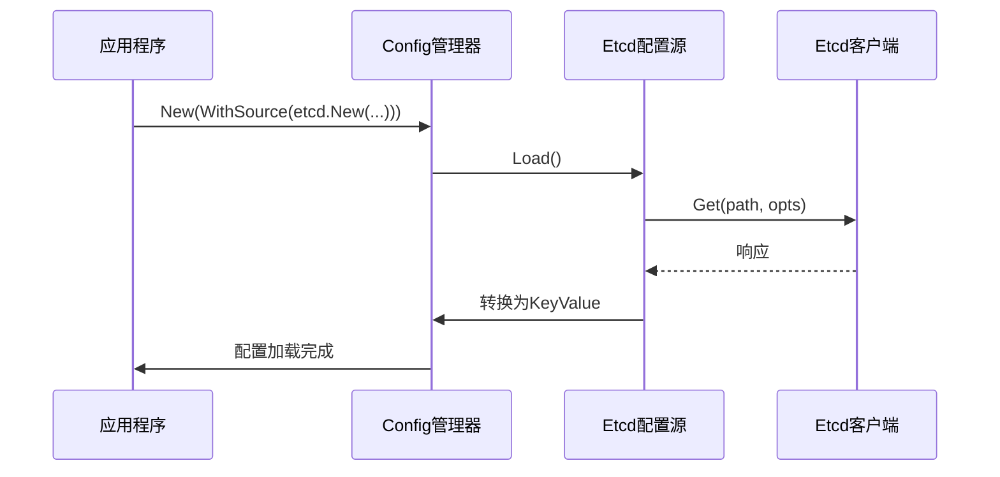

**图示来源**
- [etcd/config.go](file://contrib/config/etcd/config.go#L49-L67)
- [etcd/watcher.go](file://contrib/config/etcd/watcher.go#L19-L33)

### Kubernetes配置源

Kubernetes配置源通过`NewSource`函数创建，支持从指定命名空间的ConfigMap中加载配置。配置源支持标签选择器和字段选择器，可以精确控制配置的加载范围。

**初始化参数：**
- `Namespace`: 设置命名空间
- `LabelSelector`: 设置标签选择器
- `FieldSelector`: 设置字段选择器
- `KubeConfig`: 设置KubeConfig文件路径
- `Master`: 设置Master URL

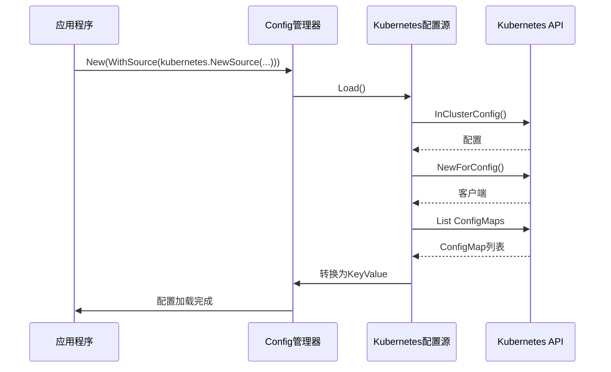

**图示来源**
- [kubernetes/config.go](file://contrib/config/kubernetes/config.go#L76-L83)
- [kubernetes/watcher.go](file://contrib/config/kubernetes/watcher.go#L19-L30)

### Nacos配置源

Nacos配置源通过`NewConfigSource`函数创建，需要提供Nacos配置客户端实例和配置参数。配置源支持从指定的Data ID和Group中加载配置。

**初始化参数：**
- `WithGroup`: 设置配置组
- `WithDataID`: 设置数据ID

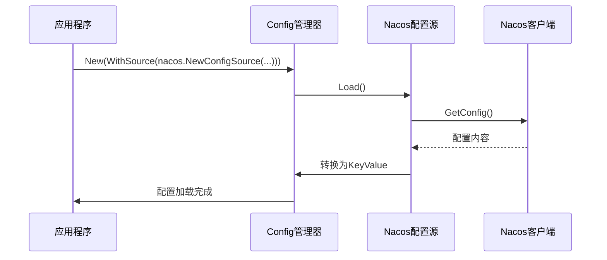

**图示来源**
- [nacos/config.go](file://contrib/config/nacos/config.go#L40-L45)
- [nacos/watcher.go](file://contrib/config/nacos/watcher.go#L25-L36)

### Polaris配置源

Polaris配置源通过`New`函数创建，需要提供Polaris配置API客户端实例和配置参数。配置源支持从指定的命名空间、文件组和文件名中加载配置。

**初始化参数：**
- `WithNamespace`: 设置命名空间
- `WithFileGroup`: 设置文件组
- `WithFileName`: 设置文件名

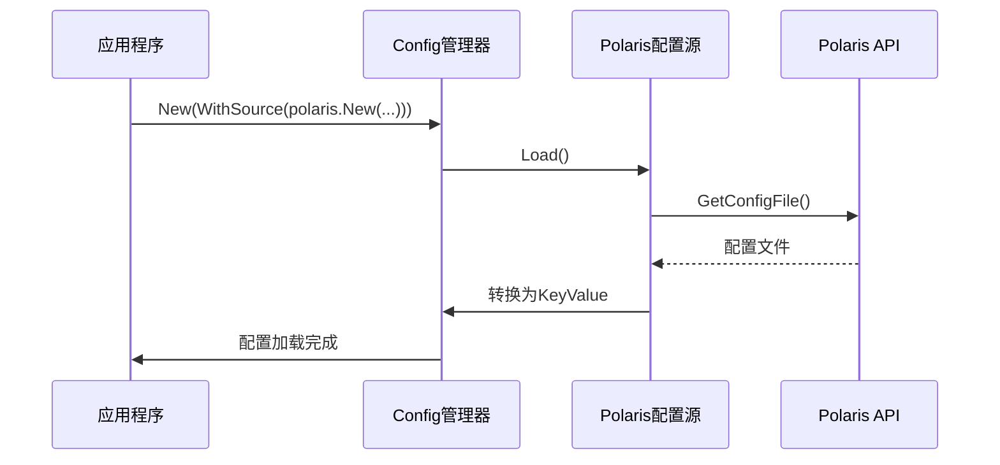

**图示来源**
- [polaris/config.go](file://contrib/config/polaris/config.go#L50-L72)

## 配置拉取与监听机制

配置中心的拉取与监听机制是动态配置管理的核心，它确保了配置的实时性和一致性。系统通过`Load`方法实现配置拉取，通过`Watch`方法实现配置监听。

### 配置拉取流程

配置拉取流程从`Config.Load()`方法开始，依次调用各个配置源的`Load`方法，获取配置数据并合并到读取器中。

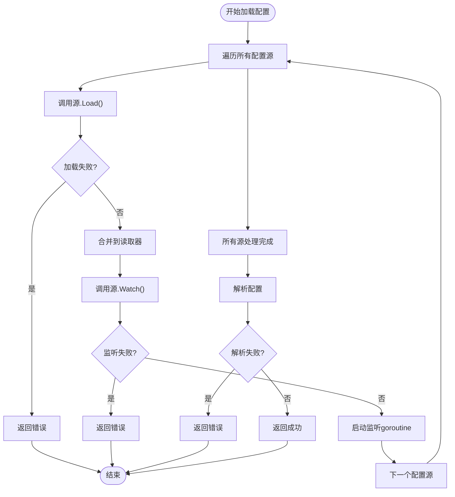

**图示来源**
- [config.go](file://config/config.go#L96-L121)

### Watch机制实现

Watch机制通过`Watcher`接口实现，每个配置源都提供了相应的`Watcher`实现。当配置发生变化时，`Watcher`会通知配置管理器，触发配置的重新加载。

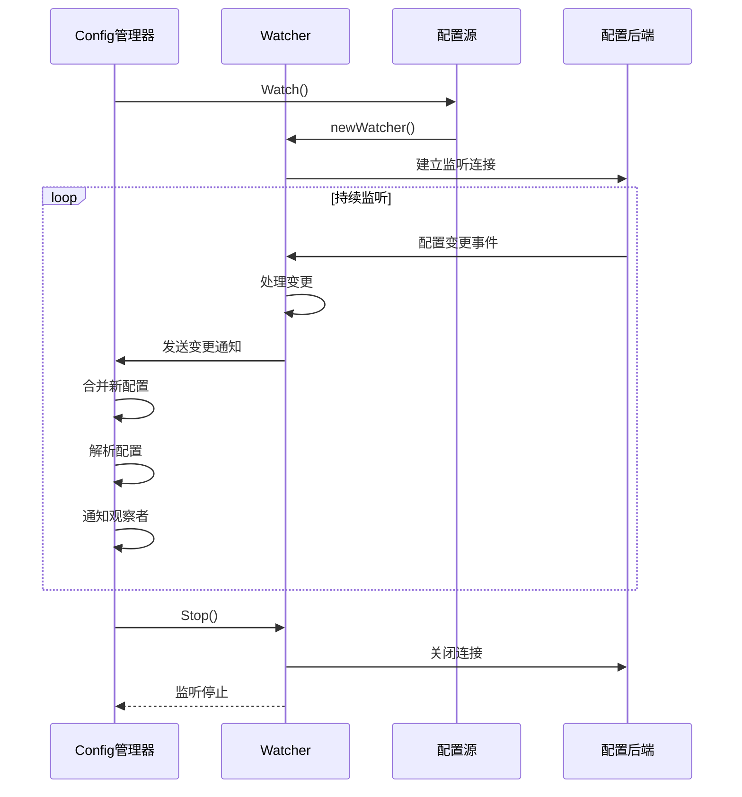

**图示来源**
- [config.go](file://config/config.go#L62-L93)
- [apollo/watcher.go](file://contrib/config/apollo/watcher.go#L74-L88)
- [consul/watcher.go](file://contrib/config/consul/watcher.go#L61-L87)
- [etcd/watcher.go](file://contrib/config/etcd/watcher.go#L19-L33)
- [kubernetes/watcher.go](file://contrib/config/kubernetes/watcher.go#L19-L30)
- [nacos/watcher.go](file://contrib/config/nacos/watcher.go#L25-L36)

### 错误恢复策略

配置中心实现了完善的错误恢复策略，确保在配置源不可用或网络异常时系统仍能正常运行。

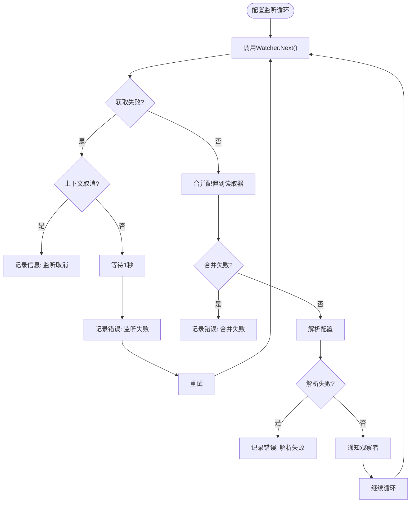

**图示来源**
- [config.go](file://config/config.go#L62-L93)

## 格式解析与本地缓存

配置中心的格式解析与本地缓存机制确保了配置数据的正确性和访问效率。

### 格式解析

格式解析通过`Decoder`接口实现，支持多种配置格式的解析，包括JSON、YAML、XML等。

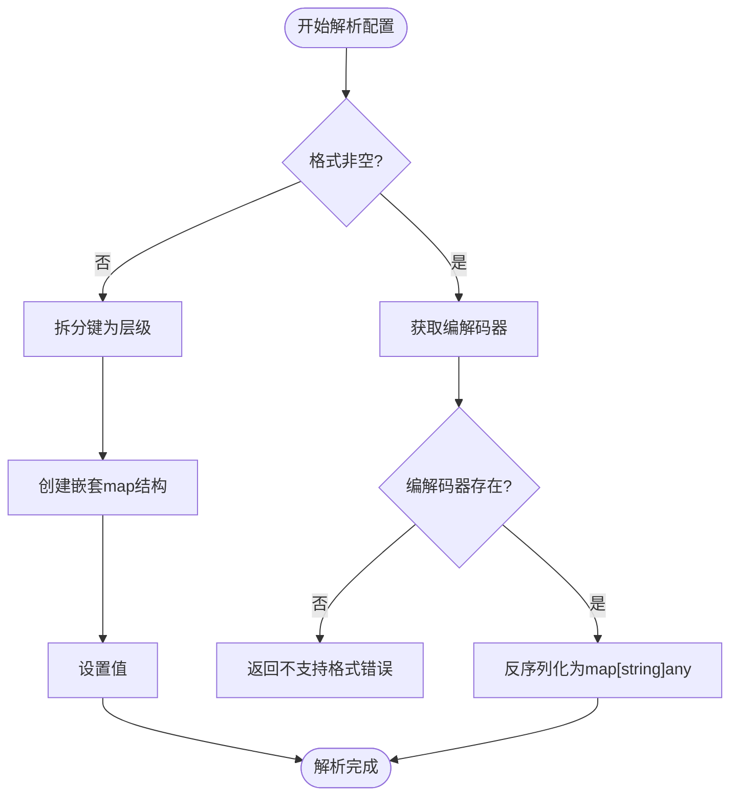

**图示来源**
- [options.go](file://config/options.go#L72-L91)

### 本地缓存机制

本地缓存通过`sync.Map`实现，确保了配置数据的线程安全访问。缓存机制包括配置值缓存和观察者缓存。

```mermaid
classDiagram
class config {
+opts options
+reader Reader
+cached sync.Map
+observers sync.Map
+watchers []Watcher
}
class Reader {
+opts options
+values map[string]any
+lock sync.Mutex
}
config --> Reader : "包含"
config --> sync.Map : "缓存"
config --> sync.Map : "观察者"
config --> []Watcher : "监听器"
class options {
+sources []Source
+decoder Decoder
+resolver Resolver
+merge Merge
}
Reader --> options : "配置"
Reader --> map[string]any : "存储"
Reader --> sync.Mutex : "同步"
```

**图示来源**
- [config.go](file://config/config.go#L36-L42)
- [reader.go](file://config/reader.go#L25-L28)

## 多配置源组合使用

Kratos框架支持多配置源的组合使用，可以通过优先级处理实现配置的覆盖和合并。

### 优先级处理

当多个配置源包含相同配置项时，后加载的配置源会覆盖先加载的配置源。

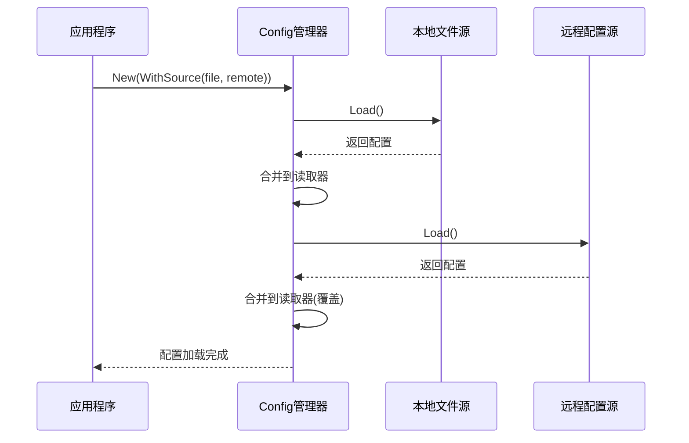

**图示来源**
- [config.go](file://config/config.go#L96-L121)

## 配置热更新流程

配置热更新流程从配置变更开始，经过监听、合并、解析到最终应用生效。

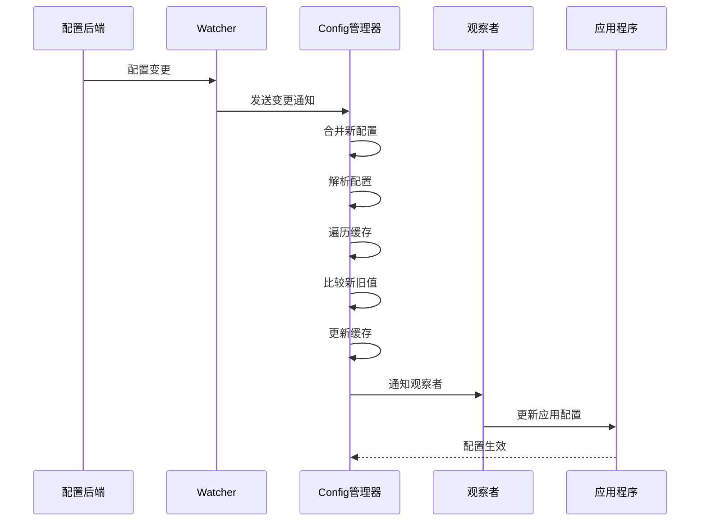

**图示来源**
- [config.go](file://config/config.go#L62-L93)

## 高延迟网络处理

在高延迟网络环境下，配置中心通过超时配置和降级策略确保系统的稳定性。

### 超时配置

配置源的初始化和操作都支持上下文超时控制，防止长时间阻塞。

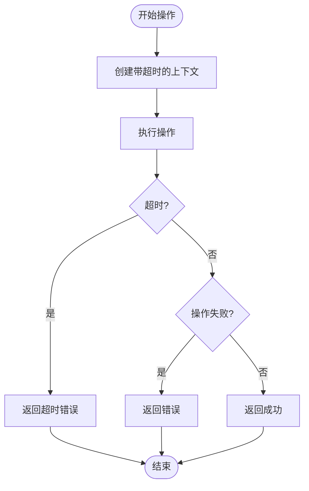

**图示来源**
- [consul/config.go](file://contrib/config/consul/config.go#L18-L20)
- [etcd/config.go](file://contrib/config/etcd/config.go#L18-L19)

### 降级策略

当远程配置源不可用时，系统可以降级到本地配置或使用备份配置。

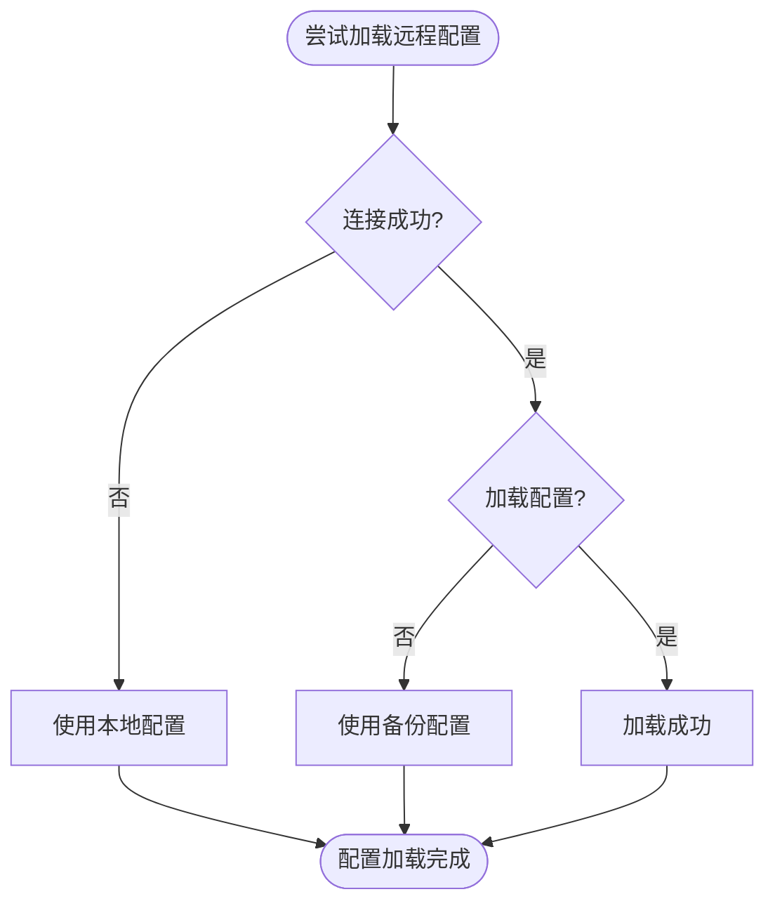

**图示来源**
- [apollo/apollo.go](file://contrib/config/apollo/apollo.go#L65-L76)

## 新配置源插件开发

开发新的配置源插件需要实现`Source`和`Watcher`接口，并遵循Kratos框架的规范。

### Source接口实现要点

1. 实现`Load()`方法，返回配置键值对
2. 实现`Watch()`方法，返回`Watcher`实例
3. 处理配置格式识别
4. 实现错误处理和重试机制

```go
// 示例代码路径: contrib/config/consul/config.go
// func (s *source) Load() ([]*config.KeyValue, error) { ... }
// func (s *source) Watch() (config.Watcher, error) { ... }
```

### 单元测试建议

1. 测试配置加载功能
2. 测试配置监听功能
3. 测试错误恢复机制
4. 测试并发安全性

```go
// 示例代码路径: contrib/config/consul/config_test.go
// func Test_source_Load(t *testing.T) { ... }
// func Test_source_Watch(t *testing.T) { ... }
```

**本节来源**
- [source.go](file://config/source.go#L10-L20)
- [consul/config.go](file://contrib/config/consul/config.go#L62-L84)
- [consul/watcher.go](file://contrib/config/consul/watcher.go#L90-L96)