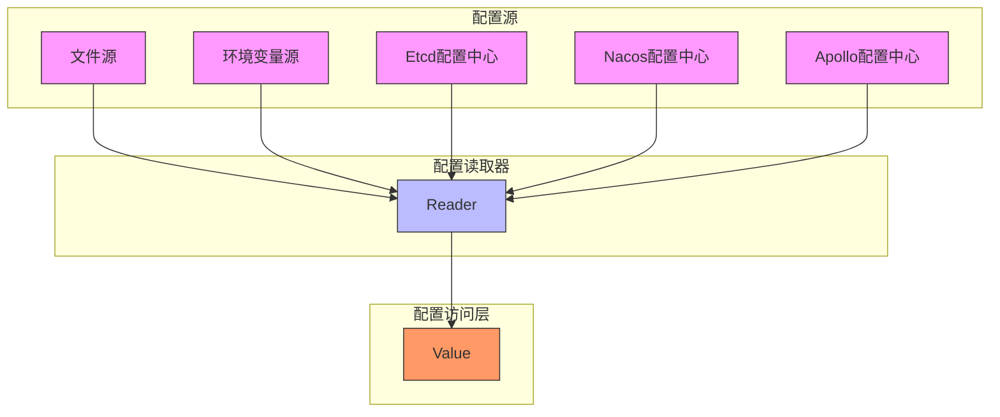
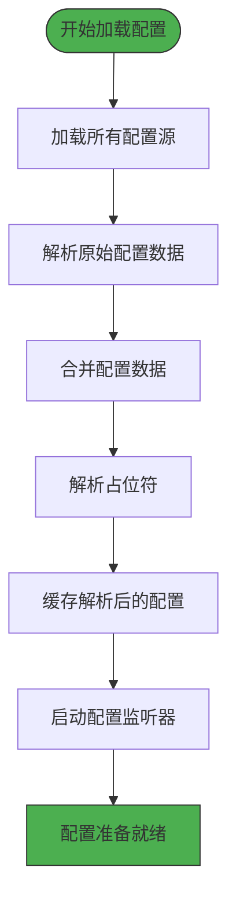
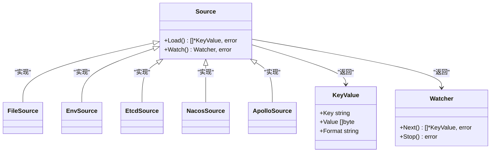
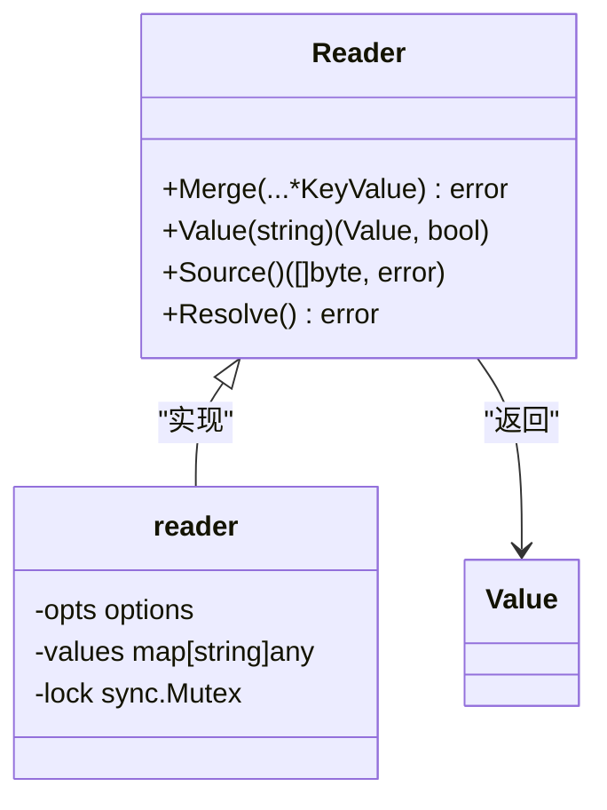
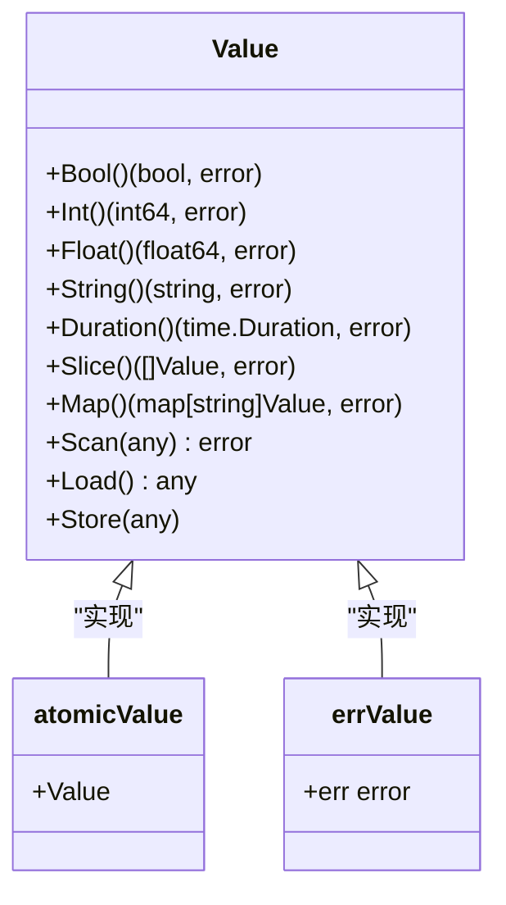
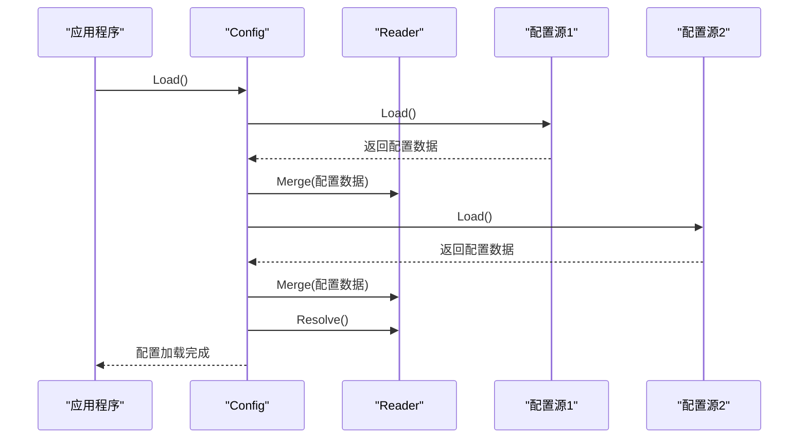
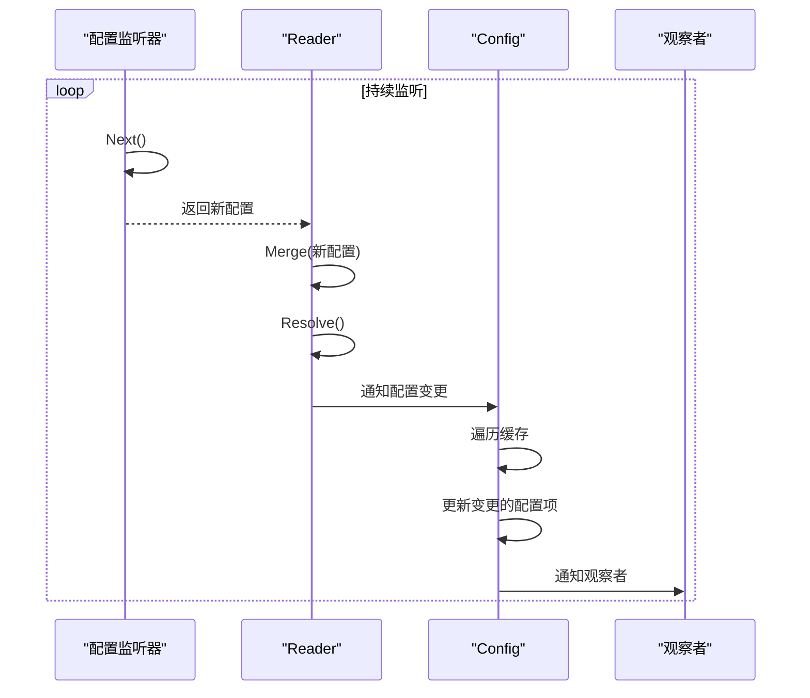
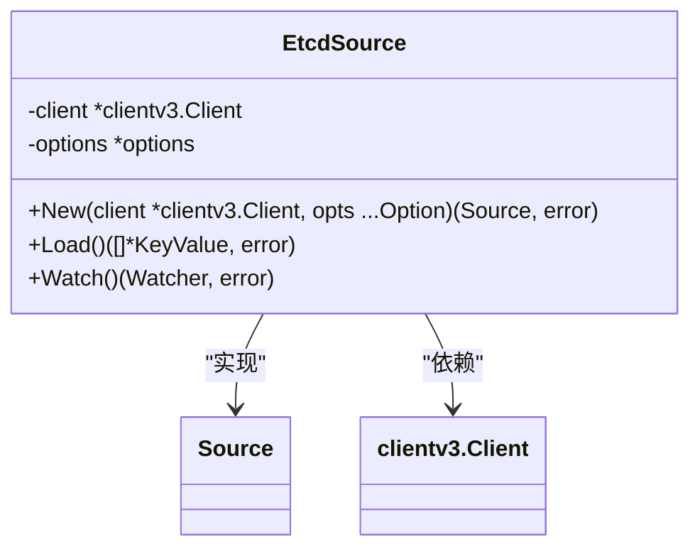
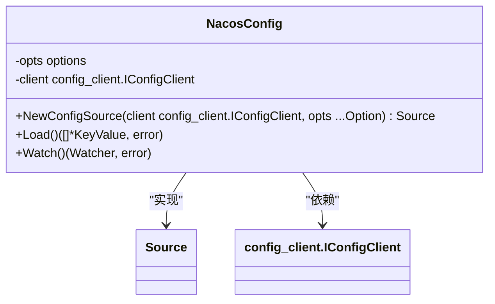
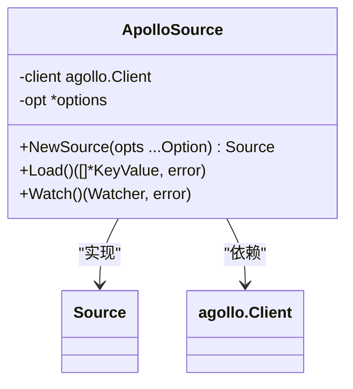

# 配置管理

<cite>
**本文档引用的文件**
- [config.go](file://config/config.go)
- [source.go](file://config/source.go)
- [reader.go](file://config/reader.go)
- [value.go](file://config/value.go)
- [options.go](file://config/options.go)
- [file.go](file://config/file/file.go)
- [env.go](file://config/env/env.go)
- [etcd\config.go](file://contrib/config/etcd/config.go)
- [nacos\config.go](file://contrib/config/nacos/config.go)
- [apollo.go](file://contrib/config/apollo/apollo.go)
- [encoding.go](file://encoding/encoding.go)
</cite>

## 目录
1. [简介](#简介)
2. [核心架构](#核心架构)
3. [配置加载生命周期](#配置加载生命周期)
4. [核心接口设计](#核心接口设计)
5. [配置合并策略与优先级](#配置合并策略与优先级)
6. [配置热更新与监听](#配置热更新与监听)
7. [与配置中心集成](#与配置中心集成)
8. [最佳实践](#最佳实践)

## 简介
Kratos框架的配置管理系统提供了一套灵活、可扩展的配置管理解决方案，支持从多种数据源加载配置，并实现类型安全的访问。该系统采用分层设计，将配置的获取、解析和访问分离，通过Source、Reader、Value三个核心接口协同工作，实现了配置管理的高内聚低耦合。系统支持JSON、YAML、Protobuf等多种配置格式，并提供了占位符解析、类型转换等高级功能。

## 核心架构
Kratos配置管理系统采用分层架构设计，包含三个核心组件：Source负责从不同位置获取原始配置数据，Reader负责将原始数据解析为结构化格式，Value负责提供类型安全的配置访问。这种分层设计使得系统具有良好的扩展性和灵活性。

**图源**
- [config.go](file://config/config.go#L20-L34)
- [source.go](file://config/source.go#L10-L14)
- [reader.go](file://config/reader.go#L18-L23)

## 配置加载生命周期
配置管理系统的生命周期从配置加载开始，经过解析、合并、解析占位符等步骤，最终提供给应用程序使用。整个过程由Config接口的Load方法驱动，支持同步加载和异步监听。

**图源**
- [config.go](file://config/config.go#L96-L121)
- [reader.go](file://config/reader.go#L73-L77)

**节源**
- [config.go](file://config/config.go#L96-L121)

## 核心接口设计
配置管理系统的核心由三个接口构成：Source、Reader和Value。这三个接口各司其职，共同完成配置管理的完整功能。

### Source接口
Source接口负责从不同位置获取原始配置数据，支持文件、环境变量、远程配置中心等多种数据源。

**图源**
- [source.go](file://config/source.go#L10-L21)
- [file.go](file://config/file/file.go#L12)
- [env.go](file://config/env/env.go#L10)
- [etcd\config.go](file://contrib/config/etcd/config.go#L44)
- [nacos\config.go](file://contrib/config/nacos/config.go#L35)
- [apollo.go](file://contrib/config/apollo/apollo.go#L16)

**节源**
- [source.go](file://config/source.go#L10-L21)

### Reader接口
Reader接口负责将原始配置数据解析为结构化格式，并处理配置的合并和占位符解析。

**图源**
- [reader.go](file://config/reader.go#L18-L23)
- [reader.go](file://config/reader.go#L25-L29)

**节源**
- [reader.go](file://config/reader.go#L18-L23)

### Value接口
Value接口提供类型安全的配置访问，支持多种数据类型和类型转换。

**图源**
- [value.go](file://config/value.go#L22-L33)
- [value.go](file://config/value.go#L35-L37)
- [value.go](file://config/value.go#L180-L182)

**节源**
- [value.go](file://config/value.go#L22-L33)

## 配置合并策略与优先级
当多个配置源提供相同配置项时，系统采用合并策略来确定最终的配置值。默认使用mergo库的Map函数进行合并，支持覆盖模式。

**图源**
- [config.go](file://config/config.go#L96-L121)
- [reader.go](file://config/reader.go#L39-L58)

**节源**
- [config.go](file://config/config.go#L96-L121)
- [options.go](file://config/options.go#L49-L51)

## 配置热更新与监听
系统支持配置的热更新，通过Watcher接口实现配置变更的监听和通知。当配置发生变化时，系统会自动更新缓存并通知注册的观察者。

**图源**
- [config.go](file://config/config.go#L62-L93)
- [source.go](file://config/source.go#L17-L20)

**节源**
- [config.go](file://config/config.go#L62-L93)

## 与配置中心集成
Kratos框架通过contrib模块提供了与主流配置中心的集成，包括Etcd、Nacos、Apollo等。

### Etcd集成

**图源**
- [etcd\config.go](file://contrib/config/etcd/config.go#L44-L47)

**节源**
- [etcd\config.go](file://contrib/config/etcd/config.go#L44-L97)

### Nacos集成

**图源**
- [nacos\config.go](file://contrib/config/nacos/config.go#L35-L38)

**节源**
- [nacos\config.go](file://contrib/config/nacos/config.go#L35-L82)

### Apollo集成

**图源**
- [apollo.go](file://contrib/config/apollo/apollo.go#L16-L18)

**节源**
- [apollo.go](file://contrib/config/apollo/apollo.go#L16-L287)

## 最佳实践
在使用Kratos配置管理系统时，建议遵循以下最佳实践：
1. 使用多种配置源组合，如环境变量+文件+远程配置中心
2. 合理设置配置项的优先级，确保关键配置能够被正确覆盖
3. 使用占位符功能实现配置的动态解析
4. 注册配置变更监听器，实现配置的热更新
5. 使用类型安全的Value接口访问配置，避免类型转换错误