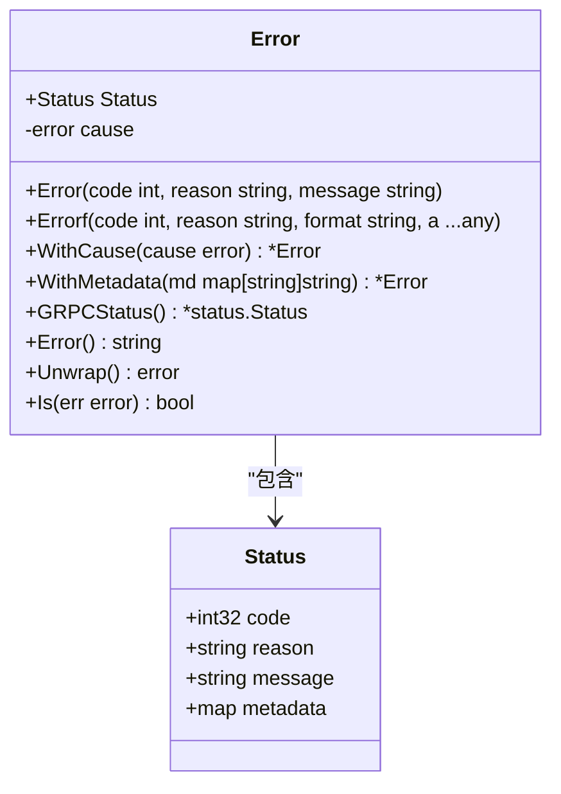
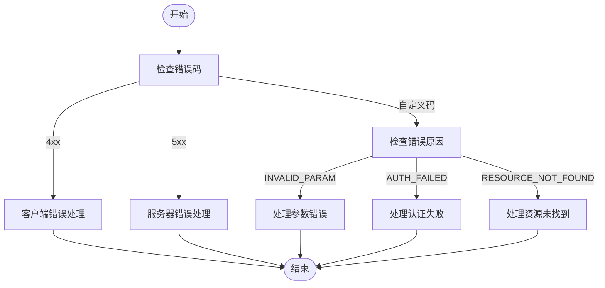
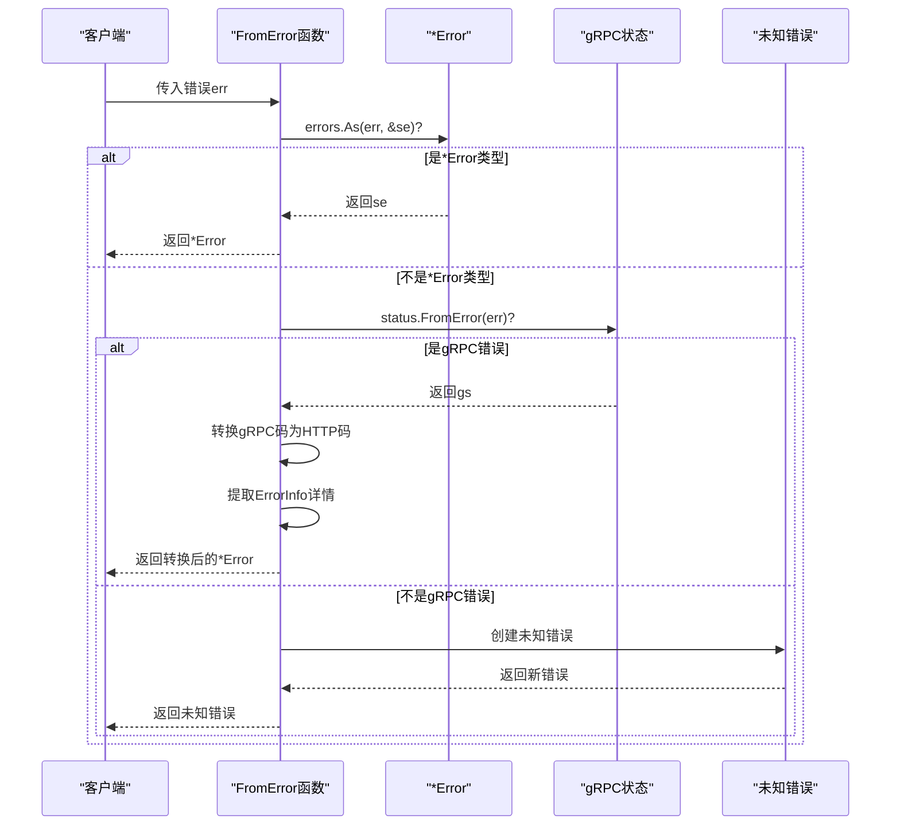
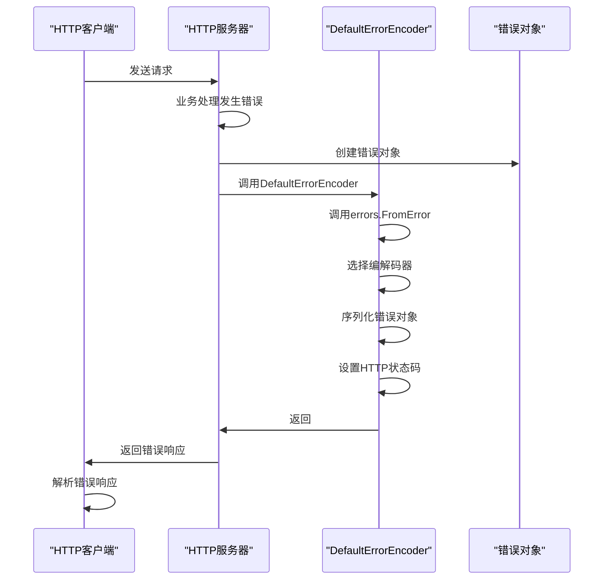
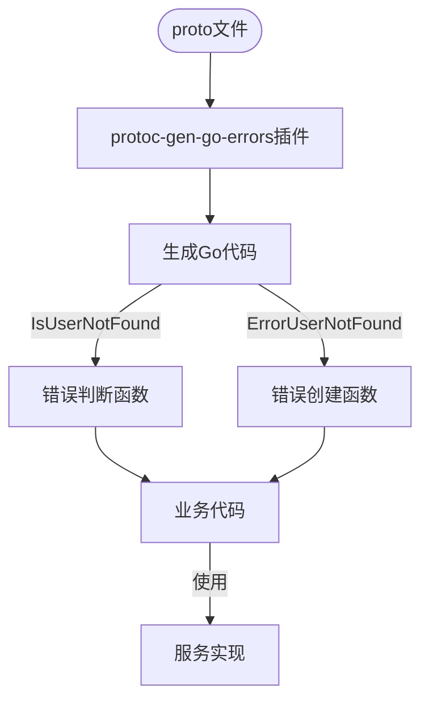

# 错误处理

<cite>
**本文档引用的文件**  
- [errors.proto](file://errors/errors.proto)
- [errors.go](file://errors/errors.go)
- [types.go](file://errors/types.go)
- [wrap.go](file://errors/wrap.go)
- [transport/http/status/status.go](file://transport/http/status/status.go)
- [transport/http/server.go](file://transport/http/server.go)
- [transport/http/client.go](file://transport/http/client.go)
- [transport/grpc/interceptor.go](file://transport/grpc/interceptor.go)
- [middleware/recovery/recovery.go](file://middleware/recovery/recovery.go)
- [cmd/protoc-gen-go-errors/errors.go](file://cmd/protoc-gen-go-errors/errors.go)
- [cmd/protoc-gen-go-errors/errorsTemplate.tpl](file://cmd/protoc-gen-go-errors/errorsTemplate.tpl)
</cite>

## 目录
1. [简介](#简介)
2. [错误模型定义](#错误模型定义)
3. [错误创建与工厂函数](#错误创建与工厂函数)
4. [错误码与错误原因](#错误码与错误原因)
5. [Go错误到Protobuf错误的转换](#go错误到protobuf错误的转换)
6. [HTTP/gRPC响应中的错误传递](#httpproto响应中的错误传递)
7. [客户端错误处理最佳实践](#客户端错误处理最佳实践)
8. [自定义错误码的定义与扩展](#自定义错误码的定义与扩展)
9. [错误处理中间件](#错误处理中间件)

## 简介
Kratos框架提供了一套统一的错误处理机制，通过Protobuf定义了标准化的错误模型。该机制确保了在微服务架构中，无论是HTTP还是gRPC通信，都能以一致的方式处理和传递错误信息。本文档详细介绍了Kratos框架中的错误处理体系，包括错误模型的定义、错误的创建与转换、在不同传输协议中的传递方式，以及客户端的最佳实践。

## 错误模型定义
Kratos框架使用Protobuf定义了统一的错误模型，核心定义位于`errors.proto`文件中。该模型包含四个关键字段：

- **code**: 整数类型的错误码，用于程序判断和HTTP状态码映射
- **reason**: 字符串类型的错误原因，用于业务分类和错误识别
- **message**: 详细的错误消息，用于描述错误的具体情况
- **metadata**: 键值对形式的元数据，用于携带额外的上下文信息



**图表来源**  
- [errors.proto](file://errors/errors.proto#L12-L17)
- [errors.go](file://errors/errors.go#L23-L26)

**本节来源**  
- [errors.proto](file://errors/errors.proto#L1-L26)
- [errors.go](file://errors/errors.go#L22-L65)

## 错误创建与工厂函数
Kratos框架提供了多种方式来创建符合规范的错误对象。最基础的是`errors.New`函数，它接受错误码、错误原因和错误消息三个参数来创建一个错误对象。

除了基础的`New`函数，框架还提供了一系列工厂函数，如`errors.BadRequest`、`errors.Unauthorized`等，这些函数对应常见的HTTP状态码，简化了常见错误的创建过程。

```go
// 创建一个参数错误
err := errors.BadRequest("INVALID_PARAM", "参数格式不正确")

// 创建一个内部服务器错误
err := errors.InternalServer("SERVER_ERROR", "服务器内部错误")

// 使用WithMetadata添加额外信息
err = err.WithMetadata(map[string]string{
    "request_id": "12345",
    "user_id": "67890",
})
```

**本节来源**  
- [errors.go](file://errors/errors.go#L67-L86)
- [types.go](file://errors/types.go#L4-L101)

## 错误码与错误原因
在Kratos的错误模型中，错误码（code）和错误原因（reason）有着明确的区分和不同的用途：

- **错误码（code）**: 主要用于程序判断和HTTP状态码映射。它是一个整数值，通常与HTTP状态码对应，如400表示Bad Request，500表示Internal Server Error。程序可以通过错误码来决定如何处理错误，比如重试策略或错误分类。

- **错误原因（reason）**: 主要用于业务分类和错误识别。它是一个字符串值，用于标识特定的业务错误类型。通过错误原因，可以精确地识别是哪种业务场景出现了问题，便于日志分析和监控告警。

这种分离设计使得系统既能通过错误码进行通用的错误处理，又能通过错误原因进行精细化的业务错误管理。



**图表来源**  
- [errors.go](file://errors/errors.go#L88-L104)
- [types.go](file://errors/types.go#L9-L101)

**本节来源**  
- [errors.go](file://errors/errors.go#L88-L104)
- [types.go](file://errors/types.go#L9-L101)

## Go错误到Protobuf错误的转换
Kratos框架提供了`FromError`函数，用于将普通的Go错误转换为Protobuf格式的错误对象。这个转换过程支持错误链（wrapped errors），能够正确处理通过`fmt.Errorf("wrap %w", err)`包装的错误。

转换过程如下：
1. 首先尝试将错误断言为`*Error`类型
2. 如果失败，则尝试从gRPC状态中解析错误
3. 如果仍然失败，则创建一个未知错误，使用默认的错误码和错误原因



**图表来源**  
- [errors.go](file://errors/errors.go#L126-L152)

**本节来源**  
- [errors.go](file://errors/errors.go#L126-L152)

## HTTP/gRPC响应中的错误传递
Kratos框架在HTTP和gRPC两种传输协议中都实现了统一的错误传递机制。

在HTTP服务中，当发生错误时，框架会使用`DefaultErrorEncoder`将错误编码为HTTP响应。这个编码器会：
1. 调用`errors.FromError`获取错误对象
2. 根据请求的Accept头选择合适的编解码器
3. 将错误对象序列化为JSON或其他格式
4. 设置正确的HTTP状态码（从错误码转换而来）
5. 将序列化后的错误信息写入响应体

在gRPC服务中，错误通过`GRPCStatus`方法转换为gRPC状态对象，然后通过gRPC框架传递给客户端。



**图表来源**  
- [transport/http/codec.go](file://transport/http/codec.go#L106-L118)
- [transport/http/server.go](file://transport/http/server.go#L107-L112)

**本节来源**  
- [transport/http/codec.go](file://transport/http/codec.go#L106-L118)
- [transport/grpc/interceptor.go](file://transport/grpc/interceptor.go#L57-L65)

## 客户端错误处理最佳实践
在客户端处理服务端错误时，应遵循以下最佳实践：

1. **统一错误处理**: 使用`errors.FromError`函数将接收到的错误转换为标准的错误对象，无论错误来自HTTP还是gRPC。

2. **基于错误码处理**: 根据错误码进行通用的错误处理，如4xx错误通常表示客户端问题，5xx错误表示服务器问题。

3. **基于错误原因处理**: 对于特定的业务错误，通过错误原因进行精确处理，实现精细化的错误响应。

4. **提取元数据**: 从错误的metadata字段中提取有用的上下文信息，如request_id，用于日志追踪和问题定位。

5. **错误链处理**: 使用`errors.Is`和`errors.As`函数正确处理错误链，能够识别包装过的错误。

```go
// 客户端错误处理示例
resp, err := client.SomeMethod(ctx, req)
if err != nil {
    // 统一转换为标准错误
    se := errors.FromError(err)
    
    // 基于错误码处理
    switch se.Code {
    case 400:
        // 处理客户端错误
        log.Printf("客户端错误: %s", se.Message)
    case 500:
        // 处理服务器错误
        log.Printf("服务器错误: %s", se.Message)
    }
    
    // 基于错误原因处理特定业务错误
    switch se.Reason {
    case "INVALID_PARAM":
        // 处理参数错误
        handleInvalidParam(se)
    case "AUTH_FAILED":
        // 处理认证失败
        handleAuthFailed(se)
    }
    
    // 提取元数据
    if requestId, ok := se.Metadata["request_id"]; ok {
        log.Printf("请求ID: %s", requestId)
    }
}
```

**本节来源**  
- [errors.go](file://errors/errors.go#L9-L34)
- [wrap.go](file://errors/wrap.go#L7-L37)

## 自定义错误码的定义与扩展
Kratos框架支持通过Protobuf枚举定义自定义错误码。开发者可以在自己的proto文件中定义错误枚举，并使用`protoc-gen-go-errors`插件生成相应的错误处理代码。

定义自定义错误码的步骤如下：

1. 在proto文件中定义枚举类型，并使用`errors.code`扩展选项指定HTTP状态码
2. 使用`protoc-gen-go-errors`插件生成错误处理代码
3. 在业务代码中使用生成的工厂函数创建自定义错误

```protobuf
enum UserError {
  option (errors.default_code) = 400;
  
  USER_NOT_FOUND = 0 [(errors.code) = 404];
  USER_ALREADY_EXISTS = 1 [(errors.code) = 409];
  INVALID_USER_STATUS = 2 [(errors.code) = 400];
}
```

插件会根据上述定义自动生成`IsUserNotFound`、`ErrorUserNotFound`等函数，简化了自定义错误的创建和判断。



**图表来源**  
- [cmd/protoc-gen-go-errors/errors.go](file://cmd/protoc-gen-go-errors/errors.go#L62-L108)
- [cmd/protoc-gen-go-errors/errorsTemplate.tpl](file://cmd/protoc-gen-go-errors/errorsTemplate.tpl#L1-L17)

**本节来源**  
- [cmd/protoc-gen-go-errors/errors.go](file://cmd/protoc-gen-go-errors/errors.go#L62-L108)
- [cmd/protoc-gen-go-errors/errorsTemplate.tpl](file://cmd/protoc-gen-go-errors/errorsTemplate.tpl#L1-L17)

## 错误处理中间件
Kratos框架提供了`recovery`中间件，用于捕获和处理服务中的panic错误。该中间件会：

1. 捕获任何panic
2. 记录详细的错误日志，包括堆栈信息
3. 将panic转换为标准的内部服务器错误
4. 继续正常的错误处理流程

此外，框架还提供了`logging`中间件，用于记录请求和响应的日志，包括错误信息。这些中间件可以组合使用，形成完整的错误处理和监控体系。

```go
// 错误处理中间件示例
app := kratos.New(
    kratos.Name("helloworld"),
    kratos.Server(
        // HTTP服务器
        http.NewServer(
            http.Address(":8000"),
            // 组合多个中间件
            http.Middleware(
                middleware.Recovery(),  // 恢复panic
                middleware.Logging(),   // 记录日志
                middleware.Tracing(),   // 链路追踪
            ),
        ),
    ),
)
```

**本节来源**  
- [middleware/recovery/recovery.go](file://middleware/recovery/recovery.go#L36-L62)
- [middleware/logging/logging.go](file://middleware/logging/logging.go)