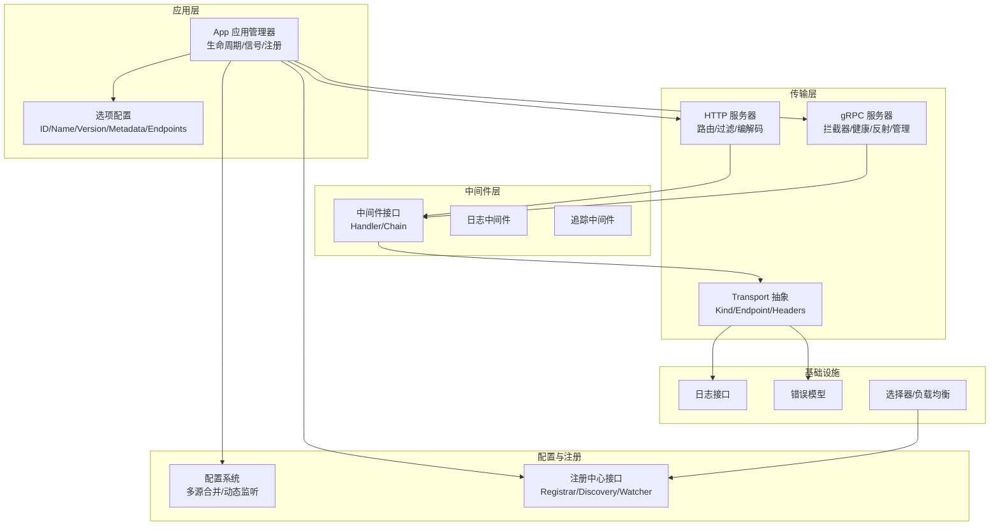
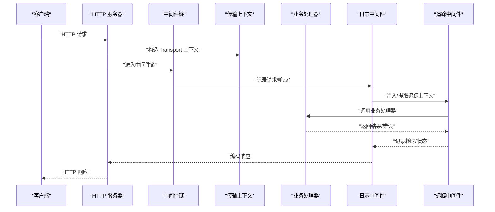
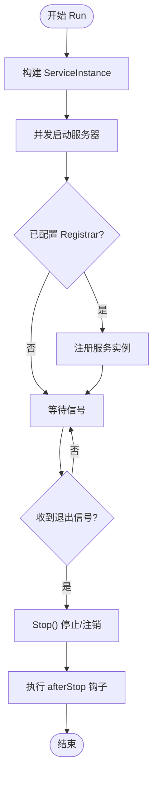
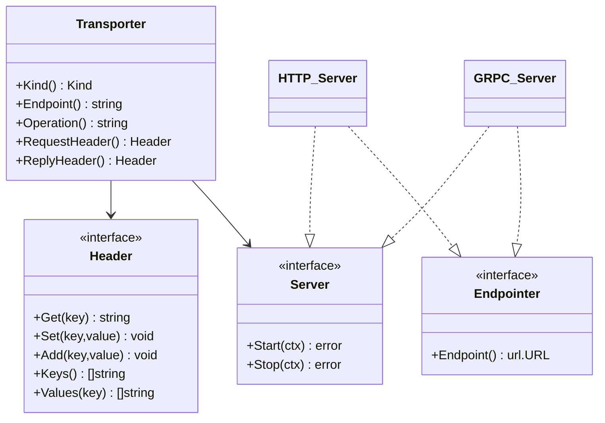
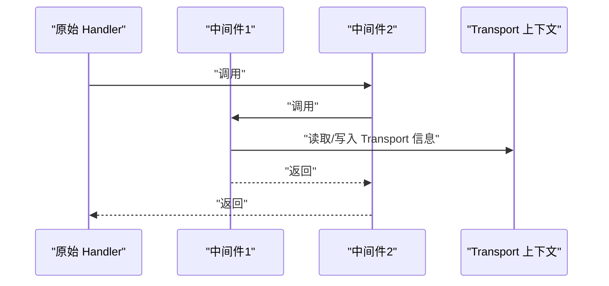
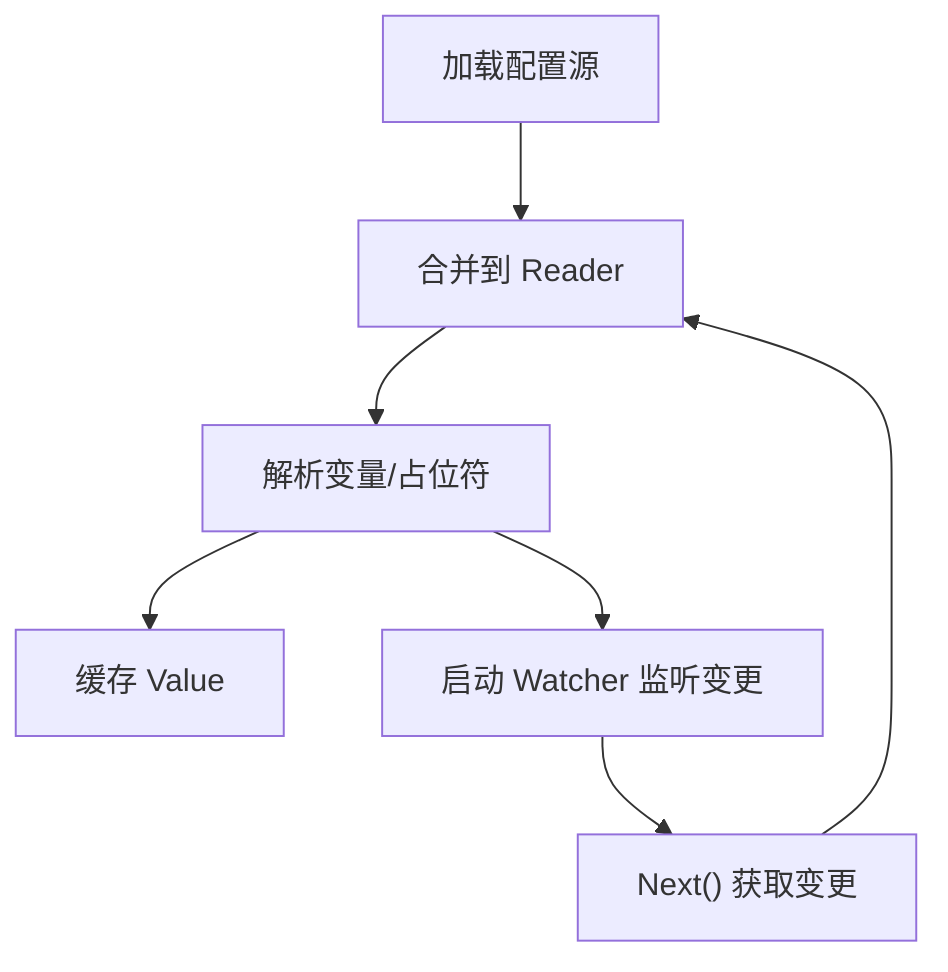
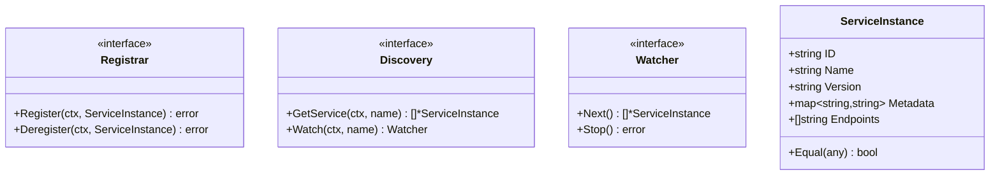
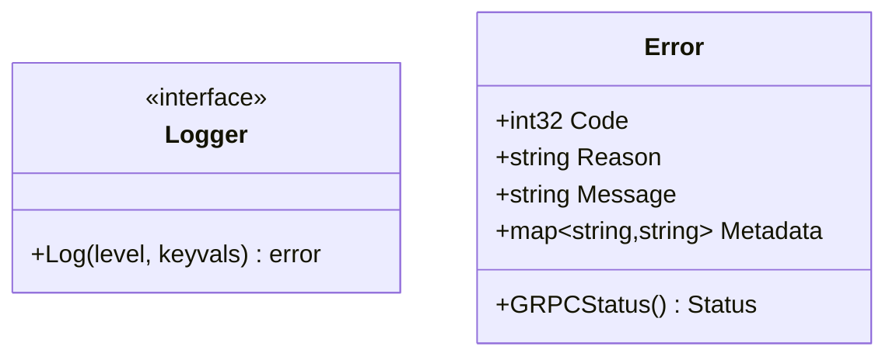
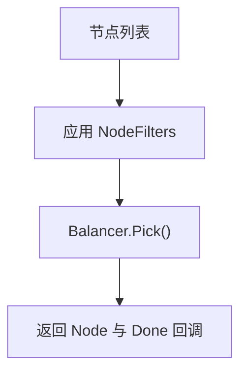
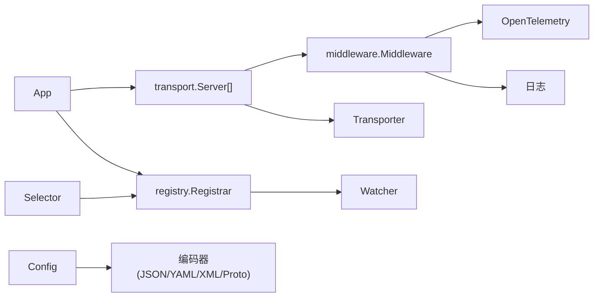

# 项目概述

<cite>
**本文引用的文件列表**
- [README.md](file://README.md)
- [app.go](file://app.go)
- [options.go](file://options.go)
- [transport/transport.go](file://transport/transport.go)
- [transport/http/server.go](file://transport/http/server.go)
- [transport/grpc/server.go](file://transport/grpc/server.go)
- [config/config.go](file://config/config.go)
- [registry/registry.go](file://registry/registry.go)
- [middleware/middleware.go](file://middleware/middleware.go)
- [middleware/logging/logging.go](file://middleware/logging/logging.go)
- [middleware/tracing/tracing.go](file://middleware/tracing/tracing.go)
- [log/log.go](file://log/log.go)
- [errors/errors.go](file://errors/errors.go)
- [selector/default_selector.go](file://selector/default_selector.go)
- [go.mod](file://go.mod)
</cite>

## 目录
1. [简介](#简介)
2. [项目结构](#项目结构)
3. [核心组件](#核心组件)
4. [架构总览](#架构总览)
5. [详细组件分析](#详细组件分析)
6. [依赖关系分析](#依赖关系分析)
7. [性能考量](#性能考量)
8. [故障排查指南](#故障排查指南)
9. [结论](#结论)
10. [附录](#附录)

## 简介
本项目是基于 Go 的微服务治理框架，定位为“模块化分层架构”的微服务开发与运行时治理平台。其设计哲学强调“简单、通用、高效、稳定、健壮、高性能、可扩展、容错、工具链”，旨在帮助开发者快速构建高可靠、可观测、可治理的微服务应用。框架以 Protobuf 为核心定义通信协议，抽象出统一的传输层（HTTP/gRPC），提供强大的中间件链能力（OpenTelemetry 追踪、Prometheus 指标、日志、限流、熔断、鉴权等），支持多种注册中心与配置中心，具备统一错误模型与元数据传递机制，并提供生成式工具链与示例模板，降低工程复杂度。

框架的关键目标：
- 提供统一的传输层抽象，屏蔽底层协议差异
- 构建可组合的中间件链，实现横切关注点
- 支持服务注册与发现、负载均衡与路由
- 提供多源配置与动态配置能力
- 集成 OpenTelemetry、Prometheus 等生态组件
- 通过统一错误模型与元数据传递提升可观测性与一致性

## 项目结构
从仓库组织看，项目采用“按功能域分层 + 组件化模块”的结构：
- 核心运行时：App 生命周期管理、选项配置、上下文注入
- 传输层：HTTP 与 gRPC 服务器封装、端点解析、Header 抽象
- 中间件：通用中间件接口与常用中间件（日志、追踪、指标、恢复、限流、验证等）
- 配置系统：多源合并、解码、动态监听与观察者模式
- 注册中心：统一 Registrar/Discovery/Watcher 接口与实例模型
- 日志与错误：统一日志接口、错误类型与状态转换
- 负载均衡与选择器：节点构建、过滤、权重与负载均衡策略
- 工具与示例：命令行工具、生成器插件、示例 API

图表来源
- [app.go](file://app.go#L1-L213)
- [options.go](file://options.go#L1-L130)
- [transport/transport.go](file://transport/transport.go#L1-L96)
- [transport/http/server.go](file://transport/http/server.go#L1-L375)
- [transport/grpc/server.go](file://transport/grpc/server.go#L1-L278)
- [middleware/middleware.go](file://middleware/middleware.go#L1-L22)
- [middleware/logging/logging.go](file://middleware/logging/logging.go#L1-L120)
- [middleware/tracing/tracing.go](file://middleware/tracing/tracing.go#L1-L97)
- [config/config.go](file://config/config.go#L1-L159)
- [registry/registry.go](file://registry/registry.go#L1-L96)
- [log/log.go](file://log/log.go#L1-L66)
- [errors/errors.go](file://errors/errors.go#L1-L153)
- [selector/default_selector.go](file://selector/default_selector.go#L1-L87)

章节来源
- [README.md](file://README.md#L21-L61)
- [go.mod](file://go.mod#L1-L49)

## 核心组件
- 应用管理器 App：负责服务实例构建、启动/停止、信号处理、注册/注销、生命周期钩子与上下文传播
- 传输层 Transport：统一 Kind(HTTP/GRPC)、Endpoint、Headers 抽象，提供 Server/Client 上下文注入
- 中间件链：Handler 函数组合，支持按路径/方法选择器应用
- 配置系统 Config：多源合并、解码、动态监听、观察者回调
- 注册中心 Registry：统一 Registrar/Discovery/Watcher 接口与 ServiceInstance 模型
- 日志与错误：统一日志接口、错误类型与 gRPC/HTTP 状态映射
- 负载均衡与选择器：节点构建、过滤、权重与多种负载均衡策略

章节来源
- [app.go](file://app.go#L1-L213)
- [transport/transport.go](file://transport/transport.go#L1-L96)
- [middleware/middleware.go](file://middleware/middleware.go#L1-L22)
- [config/config.go](file://config/config.go#L1-L159)
- [registry/registry.go](file://registry/registry.go#L1-L96)
- [log/log.go](file://log/log.go#L1-L66)
- [errors/errors.go](file://errors/errors.go#L1-L153)
- [selector/default_selector.go](file://selector/default_selector.go#L1-L87)

## 架构总览
框架采用“模块化分层架构”：
- 表现层：HTTP/gRPC 服务器封装，路由与过滤器，编解码器
- 传输层：统一 Transport 抽象，贯穿请求/响应头、端点、操作名
- 中间件层：横切能力（日志、追踪、指标、恢复、限流、验证）
- 业务层：应用 App 管理生命周期与注册，服务实例信息由传输层端点推导
- 基础设施层：配置、注册中心、日志、错误模型、选择器

图表来源
- [transport/http/server.go](file://transport/http/server.go#L260-L320)
- [middleware/logging/logging.go](file://middleware/logging/logging.go#L1-L120)
- [middleware/tracing/tracing.go](file://middleware/tracing/tracing.go#L1-L97)
- [transport/transport.go](file://transport/transport.go#L1-L96)

## 详细组件分析

### 应用管理器 App
- 职责：构建服务实例(ServiceInstance)、并发启动多个传输服务器、注册/注销、信号处理、生命周期钩子
- 关键点：使用 errgroup 并发控制；优雅停止时支持超时；注册超时可配置；通过上下文传播 AppInfo
- 典型流程：Run() 构建实例 -> 启动各服务器 -> 注册 -> 等待信号 -> 停止并反注册 -> 执行 afterStop

图表来源
- [app.go](file://app.go#L82-L174)

章节来源
- [app.go](file://app.go#L1-L213)
- [options.go](file://options.go#L1-L130)

### 传输层抽象 Transport
- 定义：Server/Endpointer/Transporter/Header/Kind(HTTP/GRPC)，提供 Server/Client 上下文注入
- HTTP 服务器：路由、过滤器、编解码器、超时、TLS、端点解析、优雅关闭
- gRPC 服务器：拦截器链、健康检查、反射、管理端口、端点解析、优雅停机

图表来源
- [transport/transport.go](file://transport/transport.go#L1-L96)
- [transport/http/server.go](file://transport/http/server.go#L1-L375)
- [transport/grpc/server.go](file://transport/grpc/server.go#L1-L278)

章节来源
- [transport/transport.go](file://transport/transport.go#L1-L96)
- [transport/http/server.go](file://transport/http/server.go#L1-L375)
- [transport/grpc/server.go](file://transport/grpc/server.go#L1-L278)

### 中间件链与常用中间件
- 中间件接口：Handler 与 Middleware 组合，Chain 反向组合形成链式调用
- 日志中间件：记录请求参数、错误码、原因、耗时、堆栈，区分 server/client
- 追踪中间件：基于 OpenTelemetry，自动注入/提取上下文，设置 Span 属性

图表来源
- [middleware/middleware.go](file://middleware/middleware.go#L1-L22)
- [middleware/logging/logging.go](file://middleware/logging/logging.go#L1-L120)
- [middleware/tracing/tracing.go](file://middleware/tracing/tracing.go#L1-L97)
- [transport/transport.go](file://transport/transport.go#L1-L96)

章节来源
- [middleware/middleware.go](file://middleware/middleware.go#L1-L22)
- [middleware/logging/logging.go](file://middleware/logging/logging.go#L1-L120)
- [middleware/tracing/tracing.go](file://middleware/tracing/tracing.go#L1-L97)

### 配置系统 Config
- 多源合并：支持多种配置源，按顺序加载并合并
- 动态监听：每个源可提供 Watcher，变更后重新解析并触发观察者
- 观察者模式：Key 变更时缓存更新并回调 Observer
- 解码与扫描：统一解码器，支持 JSON/YAML/XML/Proto 等格式

图表来源
- [config/config.go](file://config/config.go#L62-L122)

章节来源
- [config/config.go](file://config/config.go#L1-L159)

### 注册中心 Registry
- 接口：Registrar/Discovry/Watcher，统一服务实例模型 ServiceInstance
- 实例模型：包含 ID、Name、Version、Metadata、Endpoints
- Equal 比较：比较端点、元数据、版本等字段，支持排序比较

图表来源
- [registry/registry.go](file://registry/registry.go#L1-L96)

章节来源
- [registry/registry.go](file://registry/registry.go#L1-L96)

### 日志与错误
- 日志接口：Logger 接口与 With/WithContext 包装，支持 Valuer 注入
- 错误模型：统一错误类型，支持 gRPC Status 映射、错误原因与元数据、错误克隆与包装

图表来源
- [log/log.go](file://log/log.go#L1-L66)
- [errors/errors.go](file://errors/errors.go#L1-L153)

章节来源
- [log/log.go](file://log/log.go#L1-L66)
- [errors/errors.go](file://errors/errors.go#L1-L153)

### 负载均衡与选择器
- 默认选择器：组合 NodeBuilder 与 Balancer，Apply 更新节点，Select 支持 NodeFilters
- 节点与权重：WeightedNodeBuilder 构建带权重节点，Balancer Pick 返回选中节点与 Done 回调

图表来源
- [selector/default_selector.go](file://selector/default_selector.go#L1-L87)

章节来源
- [selector/default_selector.go](file://selector/default_selector.go#L1-L87)

## 依赖关系分析
- 传输层依赖中间件与日志；HTTP/gRPC 服务器均实现 transport.Server/Endpointer
- App 依赖 transport.Server 列表、registry.Registrar、log.Logger
- 中间件链依赖 transport 上下文；日志与追踪中间件依赖 OpenTelemetry
- 配置系统依赖多种编码器与 Watcher；注册中心依赖 Watcher 接口
- 选择器依赖注册中心提供的服务实例列表

图表来源
- [app.go](file://app.go#L1-L213)
- [transport/http/server.go](file://transport/http/server.go#L1-L375)
- [transport/grpc/server.go](file://transport/grpc/server.go#L1-L278)
- [middleware/tracing/tracing.go](file://middleware/tracing/tracing.go#L1-L97)
- [middleware/logging/logging.go](file://middleware/logging/logging.go#L1-L120)
- [config/config.go](file://config/config.go#L1-L159)
- [registry/registry.go](file://registry/registry.go#L1-L96)
- [selector/default_selector.go](file://selector/default_selector.go#L1-L87)

章节来源
- [go.mod](file://go.mod#L1-L49)

## 性能考量
- 并发与优雅停机：App 使用 errgroup 并发启动服务器，支持 stopTimeout 控制优雅停机
- 中间件链开销：建议按需启用中间件，避免在高频路径上叠加过多逻辑
- 编解码与序列化：优先使用 Proto 编解码，减少序列化成本
- 追踪与指标：默认使用全局 OTel Provider，注意采样率与批量上报配置
- 注册中心与选择器：合理设置 Watcher 重试与去抖，避免频繁全量刷新

## 故障排查指南
- 传输层问题
  - HTTP 服务器无法启动：检查监听地址、TLS 配置、端口占用
  - gRPC 服务器健康检查失败：确认健康服务是否启用、反射是否开启
- 中间件问题
  - 日志缺失：确认日志中间件已启用且 Logger 正常
  - 追踪无数据：检查 TextMapPropagator 是否正确注入/提取
- 配置问题
  - 配置未生效：确认 Watcher 是否正常工作，合并策略是否覆盖
  - 动态变更未触发：检查 Observer 是否注册成功
- 注册中心问题
  - 无法注册/注销：检查 Registrar 超时、网络连通性
  - 发现不到实例：确认 Watcher.Next() 是否被阻塞或提前取消
- 错误处理
  - gRPC 状态映射：确保错误类型转换正确，Reason/Metadata 一致

章节来源
- [transport/http/server.go](file://transport/http/server.go#L322-L375)
- [transport/grpc/server.go](file://transport/grpc/server.go#L225-L278)
- [middleware/logging/logging.go](file://middleware/logging/logging.go#L1-L120)
- [middleware/tracing/tracing.go](file://middleware/tracing/tracing.go#L1-L97)
- [config/config.go](file://config/config.go#L62-L122)
- [registry/registry.go](file://registry/registry.go#L1-L96)
- [errors/errors.go](file://errors/errors.go#L1-L153)

## 结论
lm-kratos 框架以“模块化分层架构”为核心，围绕传输层抽象、中间件链、配置与注册中心、日志与错误模型构建了完整的微服务治理能力。其通过 Protobuf 定义协议、统一传输上下文、可组合中间件与多源配置，结合 OpenTelemetry 生态，提供了高可用、可观测、可治理的微服务开发体验。对于初学者，建议从 App 生命周期与传输层入手，逐步掌握中间件与配置；对于资深开发者，可在注册中心与选择器扩展、中间件生态与性能优化方面深入实践。

## 附录
- 学习路径建议
  - 第一步：阅读 README 与核心组件概览
  - 第二步：实现一个最小 HTTP 服务（参考 HTTP 服务器）
  - 第三步：接入中间件链（日志、追踪）
  - 第四步：接入配置系统与注册中心
  - 第五步：扩展中间件与自定义选择器
- 典型应用场景
  - 高可用微服务：利用 App 的优雅停机与注册中心实现平滑发布
  - 服务治理：通过中间件链实现限流、熔断、鉴权
  - 监控集成：结合 OpenTelemetry 与 Prometheus 指标中间件
  - 协议一致性：统一元数据与错误模型，简化跨语言/跨协议交互